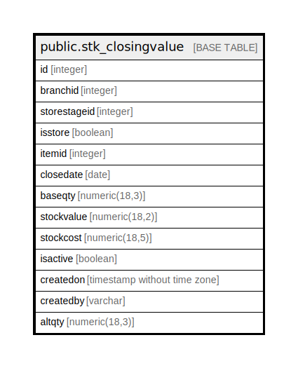

# public.stk_closingvalue

## Description

## Columns

| Name | Type | Default | Nullable | Children | Parents | Comment |
| ---- | ---- | ------- | -------- | -------- | ------- | ------- |
| id | integer | nextval('seq_stk_closingvalue_id'::regclass) | false |  |  |  |
| branchid | integer |  | false |  |  |  |
| storestageid | integer |  | false |  |  |  |
| isstore | boolean |  | false |  |  |  |
| itemid | integer |  | false |  |  |  |
| closedate | date |  | false |  |  |  |
| baseqty | numeric(18,3) |  | false |  |  |  |
| stockvalue | numeric(18,2) |  | false |  |  |  |
| stockcost | numeric(18,5) |  | false |  |  |  |
| isactive | boolean | true | false |  |  |  |
| createdon | timestamp without time zone | now() | false |  |  |  |
| createdby | varchar |  | true |  |  |  |
| altqty | numeric(18,3) |  | true |  |  |  |

## Relations

---

> Generated by [tbls](https://github.com/k1LoW/tbls)
