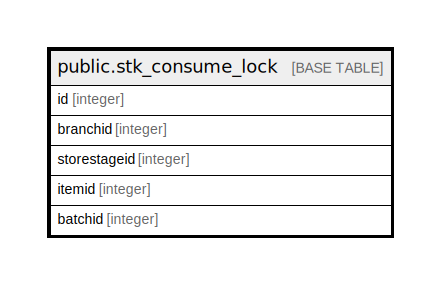

# public.stk_consume_lock

## Description

## Columns

| Name | Type | Default | Nullable | Children | Parents | Comment |
| ---- | ---- | ------- | -------- | -------- | ------- | ------- |
| id | integer | nextval('seq_stk_consume_lock_id'::regclass) | false |  |  |  |
| branchid | integer |  | false |  |  |  |
| storestageid | integer |  | false |  |  |  |
| itemid | integer |  | false |  |  |  |
| batchid | integer |  | false |  |  |  |

## Relations

---

> Generated by [tbls](https://github.com/k1LoW/tbls)
