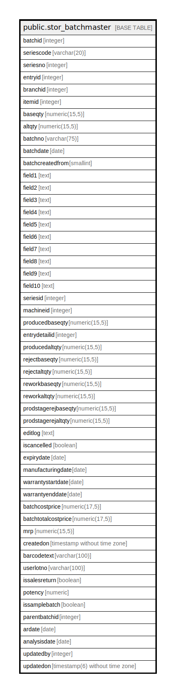

# public.stor_batchmaster

## Description

## Columns

| Name | Type | Default | Nullable | Children | Parents | Comment |
| ---- | ---- | ------- | -------- | -------- | ------- | ------- |
| batchid | integer | nextval('stor_batchmaster_batchid_seq'::regclass) | false |  |  |  |
| seriescode | varchar(20) |  | true |  |  |  |
| seriesno | integer |  | true |  |  |  |
| entryid | integer |  | true |  |  |  |
| branchid | integer |  | true |  |  |  |
| itemid | integer |  | true |  |  |  |
| baseqty | numeric(15,5) |  | true |  |  |  |
| altqty | numeric(15,5) |  | true |  |  |  |
| batchno | varchar(75) |  | true |  |  |  |
| batchdate | date | now() | true |  |  |  |
| batchcreatedfrom | smallint |  | true |  |  | -- Production - 1 -- MRN -2 -- Store Opening Stock -3 -- Stage Opening Stock -4 -- Stock Adjustment -5 -- Sample Batch Issue - 6 -- By Product From Production - 7 |
| field1 | text |  | true |  |  |  |
| field2 | text |  | true |  |  |  |
| field3 | text |  | true |  |  |  |
| field4 | text |  | true |  |  |  |
| field5 | text |  | true |  |  |  |
| field6 | text |  | true |  |  |  |
| field7 | text |  | true |  |  |  |
| field8 | text |  | true |  |  |  |
| field9 | text |  | true |  |  |  |
| field10 | text |  | true |  |  |  |
| seriesid | integer |  | true |  |  |  |
| machineid | integer | 0 | true |  |  | Used to generate machine dependent batchno |
| producedbaseqty | numeric(15,5) |  | true |  |  |  |
| entrydetailid | integer |  | true |  |  |  |
| producedaltqty | numeric(15,5) |  | true |  |  |  |
| rejectbaseqty | numeric(15,5) |  | true |  |  |  |
| rejectaltqty | numeric(15,5) |  | true |  |  |  |
| reworkbaseqty | numeric(15,5) |  | true |  |  |  |
| reworkaltqty | numeric(15,5) |  | true |  |  |  |
| prodstagerejbaseqty | numeric(15,5) | 0 | true |  |  | Store qty which are rejected during production( used only to display in report ) |
| prodstagerejaltqty | numeric(15,5) | 0 | true |  |  | Store qty which are rejected during production( used only to display in report ) |
| editlog | text |  | true |  |  |  |
| iscancelled | boolean | false | true |  |  |  |
| expirydate | date |  | true |  |  |  |
| manufacturingdate | date |  | true |  |  |  |
| warrantystartdate | date |  | true |  |  |  |
| warrantyenddate | date |  | true |  |  |  |
| batchcostprice | numeric(17,5) |  | true |  |  |  |
| batchtotalcostprice | numeric(17,5) |  | true |  |  |  |
| mrp | numeric(15,5) |  | true |  |  |  |
| createdon | timestamp without time zone | now() | true |  |  |  |
| barcodetext | varchar(100) |  | true |  |  |  |
| userlotno | varchar(100) |  | true |  |  |  |
| issalesreturn | boolean | false | true |  |  |  |
| potency | numeric |  | true |  |  |  |
| issamplebatch | boolean | false | false |  |  |  |
| parentbatchid | integer |  | true |  |  |  |
| ardate | date |  | true |  |  |  |
| analysisdate | date |  | true |  |  |  |
| updatedby | integer |  | true |  |  |  |
| updatedon | timestamp(6) without time zone | NULL::timestamp without time zone | true |  |  |  |

## Constraints

| Name | Type | Definition |
| ---- | ---- | ---------- |
| stor_batchmaster_pkey1 | PRIMARY KEY | PRIMARY KEY (batchid) |

## Indexes

| Name | Definition |
| ---- | ---------- |
| stor_batchmaster_pkey1 | CREATE UNIQUE INDEX stor_batchmaster_pkey1 ON public.stor_batchmaster USING btree (batchid) |
| Index_BM_SerlCr | CREATE INDEX "Index_BM_SerlCr" ON public.stor_batchmaster USING btree (batchid, batchno, field2) |
| Index_BM_SerlCr2 | CREATE INDEX "Index_BM_SerlCr2" ON public.stor_batchmaster USING btree (branchid, itemid, batchno, field2, iscancelled) WHERE (iscancelled = false) |
| Index_BatchMast_BranIdCan | CREATE INDEX "Index_BatchMast_BranIdCan" ON public.stor_batchmaster USING btree (branchid) WHERE (iscancelled = false) |
| b_batch | CREATE INDEX b_batch ON public.stor_batchmaster USING btree (batchid, itemid, batchno) |
| b_batchid | CREATE INDEX b_batchid ON public.stor_batchmaster USING btree (batchid) |
| b_entryid | CREATE INDEX b_entryid ON public.stor_batchmaster USING btree (entryid) |
| batchmaster_barcodetext | CREATE INDEX batchmaster_barcodetext ON public.stor_batchmaster USING btree (barcodetext) |
| batchmaster_barcodetext_branch | CREATE INDEX batchmaster_barcodetext_branch ON public.stor_batchmaster USING btree (barcodetext, branchid) |

## Relations

---

> Generated by [tbls](https://github.com/k1LoW/tbls)
