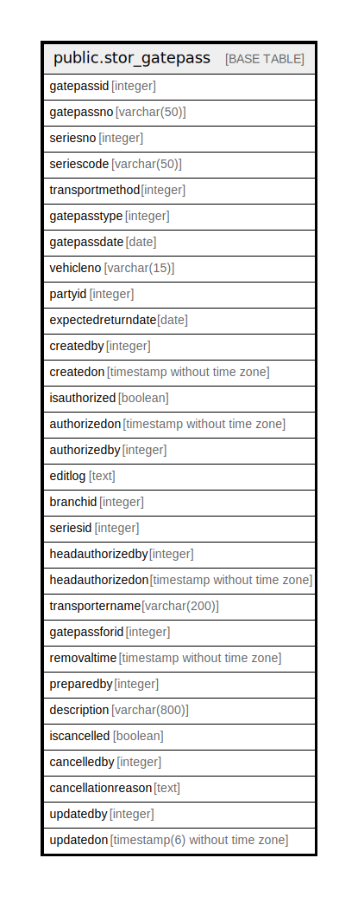

# public.stor_gatepass

## Description

## Columns

| Name | Type | Default | Nullable | Children | Parents | Comment |
| ---- | ---- | ------- | -------- | -------- | ------- | ------- |
| gatepassid | integer | nextval('stor_gatepass_gatepassid_seq'::regclass) | false |  |  |  |
| gatepassno | varchar(50) |  | true |  |  |  |
| seriesno | integer |  | true |  |  |  |
| seriescode | varchar(50) |  | true |  |  |  |
| transportmethod | integer | 0 | false |  |  |  |
| gatepasstype | integer | 1 | false |  |  | 1=RGP 2=JW 3=WO 4=SAMPLE 5=SALES |
| gatepassdate | date |  | true |  |  |  |
| vehicleno | varchar(15) |  | true |  |  |  |
| partyid | integer |  | true |  |  |  |
| expectedreturndate | date |  | true |  |  |  |
| createdby | integer |  | true |  |  |  |
| createdon | timestamp without time zone | now() | false |  |  |  |
| isauthorized | boolean | false | false |  |  |  |
| authorizedon | timestamp without time zone |  | true |  |  |  |
| authorizedby | integer |  | true |  |  |  |
| editlog | text |  | true |  |  |  |
| branchid | integer |  | true |  |  |  |
| seriesid | integer |  | true |  |  |  |
| headauthorizedby | integer |  | true |  |  |  |
| headauthorizedon | timestamp without time zone |  | true |  |  |  |
| transportername | varchar(200) |  | true |  |  |  |
| gatepassforid | integer |  | true |  |  |  |
| removaltime | timestamp without time zone | now() | true |  |  |  |
| preparedby | integer |  | true |  |  |  |
| description | varchar(800) |  | true |  |  |  |
| iscancelled | boolean |  | true |  |  |  |
| cancelledby | integer |  | true |  |  |  |
| cancellationreason | text |  | true |  |  |  |
| updatedby | integer |  | true |  |  |  |
| updatedon | timestamp(6) without time zone | NULL::timestamp without time zone | true |  |  |  |

## Constraints

| Name | Type | Definition |
| ---- | ---- | ---------- |
| stor_gatepass_pkey | PRIMARY KEY | PRIMARY KEY (gatepassid) |

## Indexes

| Name | Definition |
| ---- | ---------- |
| stor_gatepass_pkey | CREATE UNIQUE INDEX stor_gatepass_pkey ON public.stor_gatepass USING btree (gatepassid) |

## Relations

---

> Generated by [tbls](https://github.com/k1LoW/tbls)
