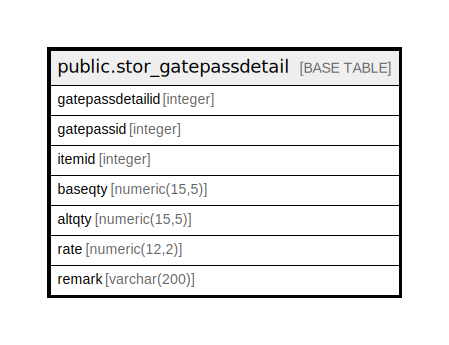

# public.stor_gatepassdetail

## Description

## Columns

| Name | Type | Default | Nullable | Children | Parents | Comment |
| ---- | ---- | ------- | -------- | -------- | ------- | ------- |
| gatepassdetailid | integer | nextval('stor_gatepassdetail_gatepassdetailid_seq'::regclass) | false |  |  |  |
| gatepassid | integer |  | true |  |  |  |
| itemid | integer |  | true |  |  |  |
| baseqty | numeric(15,5) |  | true |  |  |  |
| altqty | numeric(15,5) |  | true |  |  |  |
| rate | numeric(12,2) |  | true |  |  |  |
| remark | varchar(200) |  | true |  |  |  |

## Constraints

| Name | Type | Definition |
| ---- | ---- | ---------- |
| stor_gatepassdetail_pkey | PRIMARY KEY | PRIMARY KEY (gatepassdetailid) |

## Indexes

| Name | Definition |
| ---- | ---------- |
| stor_gatepassdetail_pkey | CREATE UNIQUE INDEX stor_gatepassdetail_pkey ON public.stor_gatepassdetail USING btree (gatepassdetailid) |

## Relations

---

> Generated by [tbls](https://github.com/k1LoW/tbls)
