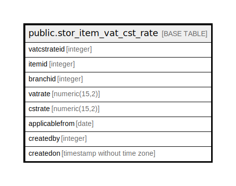

# public.stor_item_vat_cst_rate

## Description

## Columns

| Name | Type | Default | Nullable | Children | Parents | Comment |
| ---- | ---- | ------- | -------- | -------- | ------- | ------- |
| vatcstrateid | integer | nextval('stor_item_vat_cst_rate_vatcstrateid_seq'::regclass) | false |  |  |  |
| itemid | integer |  | true |  |  |  |
| branchid | integer |  | true |  |  |  |
| vatrate | numeric(15,2) | 0 | true |  |  |  |
| cstrate | numeric(15,2) | 0 | true |  |  |  |
| applicablefrom | date | now() | true |  |  |  |
| createdby | integer |  | true |  |  |  |
| createdon | timestamp without time zone | now() | true |  |  |  |

## Constraints

| Name | Type | Definition |
| ---- | ---- | ---------- |
| itm_branch_unique | UNIQUE | UNIQUE (itemid, branchid) |
| stor_item_vat_cst_rate_pkey | PRIMARY KEY | PRIMARY KEY (vatcstrateid) |

## Indexes

| Name | Definition |
| ---- | ---------- |
| itm_branch_unique | CREATE UNIQUE INDEX itm_branch_unique ON public.stor_item_vat_cst_rate USING btree (itemid, branchid) |
| stor_item_vat_cst_rate_pkey | CREATE UNIQUE INDEX stor_item_vat_cst_rate_pkey ON public.stor_item_vat_cst_rate USING btree (vatcstrateid) |

## Relations

---

> Generated by [tbls](https://github.com/k1LoW/tbls)
