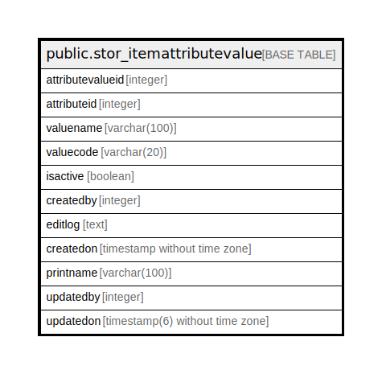

# public.stor_itemattributevalue

## Description

## Columns

| Name | Type | Default | Nullable | Children | Parents | Comment |
| ---- | ---- | ------- | -------- | -------- | ------- | ------- |
| attributevalueid | integer | nextval('stor_itemattributevalue_attributevalueid_seq'::regclass) | false |  |  |  |
| attributeid | integer |  | true |  |  |  |
| valuename | varchar(100) |  | true |  |  |  |
| valuecode | varchar(20) |  | true |  |  |  |
| isactive | boolean | true | true |  |  |  |
| createdby | integer |  | true |  |  |  |
| editlog | text |  | true |  |  |  |
| createdon | timestamp without time zone | now() | true |  |  |  |
| printname | varchar(100) |  | true |  |  |  |
| updatedby | integer |  | true |  |  |  |
| updatedon | timestamp(6) without time zone | NULL::timestamp without time zone | true |  |  |  |

## Constraints

| Name | Type | Definition |
| ---- | ---- | ---------- |
| attributevalue_pkey | PRIMARY KEY | PRIMARY KEY (attributevalueid) |

## Indexes

| Name | Definition |
| ---- | ---------- |
| attributevalue_pkey | CREATE UNIQUE INDEX attributevalue_pkey ON public.stor_itemattributevalue USING btree (attributevalueid) |

## Relations

---

> Generated by [tbls](https://github.com/k1LoW/tbls)
