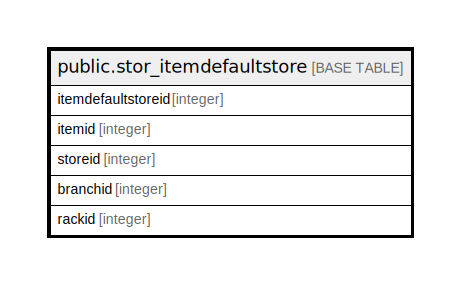

# public.stor_itemdefaultstore

## Description

## Columns

| Name | Type | Default | Nullable | Children | Parents | Comment |
| ---- | ---- | ------- | -------- | -------- | ------- | ------- |
| itemdefaultstoreid | integer | nextval('stor_itemdefaultstore_itemdefaultstoreid_seq'::regclass) | false |  |  |  |
| itemid | integer |  | true |  |  |  |
| storeid | integer |  | true |  |  |  |
| branchid | integer |  | true |  |  |  |
| rackid | integer |  | true |  |  |  |

## Constraints

| Name | Type | Definition |
| ---- | ---- | ---------- |
| stor_itemdefaultstore_pkey | PRIMARY KEY | PRIMARY KEY (itemdefaultstoreid) |
| unique_key_itemid_and_branch | UNIQUE | UNIQUE (itemid, branchid) |
| uniquestore | UNIQUE | UNIQUE (itemid, branchid) |

## Indexes

| Name | Definition |
| ---- | ---------- |
| stor_itemdefaultstore_pkey | CREATE UNIQUE INDEX stor_itemdefaultstore_pkey ON public.stor_itemdefaultstore USING btree (itemdefaultstoreid) |
| unique_key_itemid_and_branch | CREATE UNIQUE INDEX unique_key_itemid_and_branch ON public.stor_itemdefaultstore USING btree (itemid, branchid) |
| uniquestore | CREATE UNIQUE INDEX uniquestore ON public.stor_itemdefaultstore USING btree (itemid, branchid) |

## Triggers

| Name | Definition |
| ---- | ---------- |
| item_defalutstore | CREATE TRIGGER item_defalutstore BEFORE UPDATE ON public.stor_itemdefaultstore FOR EACH ROW EXECUTE FUNCTION tgr_editlog() |

## Relations

---

> Generated by [tbls](https://github.com/k1LoW/tbls)
