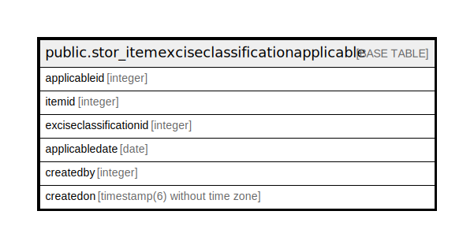

# public.stor_itemexciseclassificationapplicable

## Description

## Columns

| Name | Type | Default | Nullable | Children | Parents | Comment |
| ---- | ---- | ------- | -------- | -------- | ------- | ------- |
| applicableid | integer | nextval('stor_itemexciseclassificationapplicable_applicableid_seq'::regclass) | false |  |  |  |
| itemid | integer |  | true |  |  |  |
| exciseclassificationid | integer |  | true |  |  |  |
| applicabledate | date |  | true |  |  |  |
| createdby | integer |  | true |  |  |  |
| createdon | timestamp(6) without time zone | now() | true |  |  |  |

## Constraints

| Name | Type | Definition |
| ---- | ---- | ---------- |
| itemhsndupplicate | UNIQUE | UNIQUE (itemid, exciseclassificationid, applicabledate) |
| stor_itemexciseclassificationapplicable_pkey | PRIMARY KEY | PRIMARY KEY (applicableid) |

## Indexes

| Name | Definition |
| ---- | ---------- |
| itemhsndupplicate | CREATE UNIQUE INDEX itemhsndupplicate ON public.stor_itemexciseclassificationapplicable USING btree (itemid, exciseclassificationid, applicabledate) |
| stor_itemexciseclassificationapplicable_pkey | CREATE UNIQUE INDEX stor_itemexciseclassificationapplicable_pkey ON public.stor_itemexciseclassificationapplicable USING btree (applicableid) |

## Relations

---

> Generated by [tbls](https://github.com/k1LoW/tbls)
