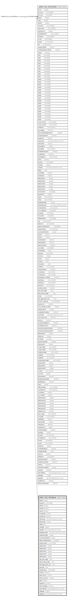

# public.stor_itemgroup

## Description

## Columns

| Name | Type | Default | Nullable | Children | Parents | Comment |
| ---- | ---- | ------- | -------- | -------- | ------- | ------- |
| groupid | integer | nextval('stor_itemgroup_groupid_seq'::regclass) | false | [public.stor_itemmaster](public.stor_itemmaster.md) |  |  |
| groupname | varchar(100) |  | true |  |  |  |
| parentid | integer |  | true |  |  |  |
| haschild | boolean |  | true |  |  |  |
| isactive | boolean | true | false |  |  |  |
| issendtotally | boolean | false | false |  |  |  |
| isauthorized | boolean | false | false |  |  |  |
| authorizedon | timestamp without time zone |  | true |  |  |  |
| authorizedby | integer |  | true |  |  |  |
| editlog | text |  | true |  |  |  |
| createdby | integer |  | true |  |  |  |
| createdon | timestamp without time zone | now() | true |  |  |  |
| headauthorizedon | timestamp without time zone |  | true |  |  |  |
| headauthorizedby | integer |  | true |  |  |  |
| exciseclassificationid | integer |  | true |  |  |  |
| abatementnotificationno | varchar(30) |  | true |  |  |  |
| rateofexciseduty | numeric(10,2) |  | true |  |  |  |
| attributevalue1 | integer |  | true |  |  |  |
| attributevalue2 | integer |  | true |  |  |  |
| attributevalue3 | integer |  | true |  |  |  |
| attributevalue4 | integer |  | true |  |  |  |
| attributevalue5 | integer |  | true |  |  |  |
| tally_sales_ledger | text |  | true |  |  |  |
| tally_purchase_ledger | text |  | true |  |  |  |
| tally_ledger_prefix_with | text |  | true |  |  |  |
| groupcode | text |  | true |  |  |  |
| parenthierarchy | varchar(500) | ''::character varying | true |  |  |  |
| sentincrm | boolean | false | true |  |  |  |
| parent_seq_id | varchar |  | true |  |  |  |
| parent_seq_name | varchar |  | true |  |  |  |
| alterid | integer |  | true |  |  |  |
| hoprofileid | smallint |  | true |  |  |  |
| ishtnomandatory | boolean | false | false |  |  |  |
| lastmodifiedon | timestamp(6) without time zone | now() | true |  |  |  |
| updatedby | integer |  | true |  |  |  |
| updatedon | timestamp(6) without time zone | NULL::timestamp without time zone | true |  |  |  |

## Constraints

| Name | Type | Definition |
| ---- | ---- | ---------- |
| itemgroup_groupname_key | UNIQUE | UNIQUE (groupname) |
| itemgroup_pkey | PRIMARY KEY | PRIMARY KEY (groupid) |

## Indexes

| Name | Definition |
| ---- | ---------- |
| itemgroup_groupname_key | CREATE UNIQUE INDEX itemgroup_groupname_key ON public.stor_itemgroup USING btree (groupname) |
| itemgroup_pkey | CREATE UNIQUE INDEX itemgroup_pkey ON public.stor_itemgroup USING btree (groupid) |

## Triggers

| Name | Definition |
| ---- | ---------- |
| trg_itemgroupalterid | CREATE TRIGGER trg_itemgroupalterid AFTER INSERT OR UPDATE ON public.stor_itemgroup FOR EACH ROW EXECUTE FUNCTION updatealterid() |

## Relations

---

> Generated by [tbls](https://github.com/k1LoW/tbls)
