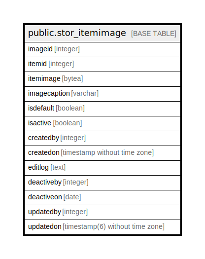

# public.stor_itemimage

## Description

## Columns

| Name | Type | Default | Nullable | Children | Parents | Comment |
| ---- | ---- | ------- | -------- | -------- | ------- | ------- |
| imageid | integer | nextval('stor_itemimage_imageid_seq'::regclass) | false |  |  |  |
| itemid | integer |  | true |  |  |  |
| itemimage | bytea |  | true |  |  |  |
| imagecaption | varchar |  | true |  |  |  |
| isdefault | boolean |  | true |  |  |  |
| isactive | boolean |  | true |  |  |  |
| createdby | integer |  | true |  |  |  |
| createdon | timestamp without time zone | now() | true |  |  |  |
| editlog | text |  | true |  |  |  |
| deactiveby | integer |  | true |  |  |  |
| deactiveon | date |  | true |  |  |  |
| updatedby | integer |  | true |  |  |  |
| updatedon | timestamp(6) without time zone | NULL::timestamp without time zone | true |  |  |  |

## Constraints

| Name | Type | Definition |
| ---- | ---- | ---------- |
| stor_itemimage_pkey | PRIMARY KEY | PRIMARY KEY (imageid) |

## Indexes

| Name | Definition |
| ---- | ---------- |
| stor_itemimage_pkey | CREATE UNIQUE INDEX stor_itemimage_pkey ON public.stor_itemimage USING btree (imageid) |

## Relations

---

> Generated by [tbls](https://github.com/k1LoW/tbls)
