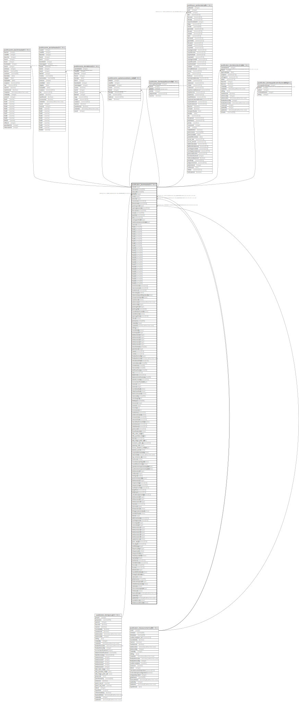

# public.stor_itemmaster

## Description

## Columns

| Name | Type | Default | Nullable | Children | Parents | Comment |
| ---- | ---- | ------- | -------- | -------- | ------- | ------- |
| itemid | integer | nextval('stor_itemmaster_itemid_seq'::regclass) | false | [public.comn_batchmaster](public.comn_batchmaster.md) [public.comn_serialmaster](public.comn_serialmaster.md) [public.comn_stockdetail](public.comn_stockdetail.md) [public.comn_updatecostdate_detail](public.comn_updatecostdate_detail.md) [public.stor_itemsupplierpriority](public.stor_itemsupplierpriority.md) [public.pur_poitemdetail](public.pur_poitemdetail.md) [public.stor_itemstandardrate](public.stor_itemstandardrate.md) [public.stor_itemsupplierattributerating](public.stor_itemsupplierattributerating.md) |  |  |
| itemname | varchar(200) |  | false |  |  |  |
| itemcode | varchar(50) |  | true |  |  |  |
| groupid | integer |  | true |  | [public.stor_itemgroup](public.stor_itemgroup.md) |  |
| unitid | integer |  | true |  | [public.stor_measurementunit](public.stor_measurementunit.md) |  |
| altunitid | integer |  | true |  | [public.stor_measurementunit](public.stor_measurementunit.md) |  |
| conversion | numeric(16,6) |  | true |  |  |  |
| denominator | numeric(16,6) |  | true |  |  |  |
| packinguomid | integer |  | true |  | [public.stor_measurementunit](public.stor_measurementunit.md) |  |
| openingbasestock | numeric(14,4) |  | true |  |  |  |
| description | varchar(1000) |  | true |  |  |  |
| remark | varchar(1000) |  | true |  |  |  |
| quantity | numeric(14,4) |  | true |  |  |  |
| rate | numeric(12,2) |  | true |  |  |  |
| costingmethodid | integer |  | true |  |  |  |
| marketevaluationmethodid | integer |  | true |  |  |  |
| isactive | boolean | true | false |  |  |  |
| field1 | varchar(50) |  | true |  |  |  |
| field2 | varchar(50) |  | true |  |  |  |
| field3 | varchar(50) |  | true |  |  |  |
| field4 | varchar(50) |  | true |  |  |  |
| field5 | varchar(50) |  | true |  |  |  |
| field6 | varchar(50) |  | true |  |  |  |
| field7 | varchar(50) |  | true |  |  |  |
| field8 | varchar(50) |  | true |  |  |  |
| field9 | varchar(50) |  | true |  |  |  |
| field10 | varchar(50) |  | true |  |  |  |
| field11 | varchar(50) |  | true |  |  |  |
| field12 | varchar(50) |  | true |  |  |  |
| field13 | varchar(50) |  | true |  |  |  |
| field14 | varchar(50) |  | true |  |  |  |
| field15 | varchar(50) |  | true |  |  |  |
| field16 | varchar(50) |  | true |  |  |  |
| field17 | varchar(50) |  | true |  |  |  |
| field18 | varchar(50) |  | true |  |  |  |
| field19 | varchar(50) |  | true |  |  |  |
| field20 | varchar(50) |  | true |  |  |  |
| field21 | varchar(50) |  | true |  |  |  |
| field22 | varchar(50) |  | true |  |  |  |
| field23 | varchar(50) |  | true |  |  |  |
| field24 | varchar(50) |  | true |  |  |  |
| field25 | varchar(50) |  | true |  |  |  |
| minimumstock | numeric(14,4) |  | true |  |  |  |
| maximumstock | numeric(14,4) |  | true |  |  |  |
| reorderlevel | numeric(14,4) |  | true |  |  |  |
| itemcategory | smallint |  | true |  |  |  |
| isbomnotrequiredforproduction | boolean | false | false |  |  |  |
| isinspectionrequired | boolean | false | false |  |  |  |
| isauthorized | boolean | false | false |  |  |  |
| authorizedon | timestamp without time zone |  | true |  |  |  |
| authorizedby | integer |  | true |  |  |  |
| packingaltuom | integer |  | true |  |  |  |
| packingofalt | numeric(14,4) |  | true |  |  |  |
| isenablebatchcreation | boolean | false | false |  |  |  |
| isenableseries | boolean | false | false |  |  |  |
| openingaltstock | numeric(14,4) |  | true |  |  |  |
| isfixed | boolean | false | true |  |  |  |
| printname | varchar(200) |  | true |  |  |  |
| createdby | integer |  | true |  |  |  |
| createdon | timestamp without time zone | now() | true |  |  |  |
| editlog | text |  | true |  |  |  |
| issendtotally | boolean | false | true |  |  |  |
| assetstypeid | integer |  | true |  |  |  |
| attributevalue1 | integer |  | true |  |  |  |
| attributevalue2 | integer |  | true |  |  |  |
| attributevalue3 | integer |  | true |  |  |  |
| attributevalue4 | integer |  | true |  |  |  |
| attributevalue5 | integer |  | true |  |  |  |
| itemshortname | varchar(10) |  | true |  |  |  |
| parentitemid | integer |  | true |  |  |  |
| vatrate | numeric(10,5) | 0 | true |  |  |  |
| cstrate | numeric(10,5) | 0 | true |  |  |  |
| headauthorizedby | integer |  | true |  |  |  |
| headauthorizedon | timestamp without time zone |  | true |  |  |  |
| criticalstocklevel | numeric(15,4) | 0 | true |  |  |  |
| commoditycode | varchar(30) |  | true |  |  |  |
| scheduleno | varchar(30) |  | true |  |  |  |
| itemserialno | varchar(30) |  | true |  |  |  |
| tariffclasification | varchar(30) |  | true |  |  |  |
| mrp | numeric(17,2) |  | true |  |  |  |
| abatement | numeric(10,2) |  | true |  |  |  |
| abatementnotificationno | varchar(30) |  | true |  |  |  |
| rateofexciseduty | numeric(10,2) |  | true |  |  |  |
| exciseclassificationid | integer |  | true |  |  |  |
| seriesid | integer |  | true |  |  |  |
| seriesno | integer |  | true |  |  |  |
| isserialonaltunit | boolean | false | true |  |  |  |
| isbatchonaltunit | boolean | false | true |  |  |  |
| batchcontinuation | boolean | false | true |  |  |  |
| nameintally | varchar(200) |  | true |  |  |  |
| unitchangelog | text |  | true |  |  |  |
| drawingno | varchar(50) |  | true |  |  |  |
| revisionno | integer | 1 | true |  |  |  |
| issueno | integer | 1 | true |  |  |  |
| reviselog | text |  | true |  |  |  |
| revisereason | text |  | true |  |  |  |
| reordertime | numeric(5,0) | 1 | true |  |  |  |
| serialcontinuation | boolean | false | true |  |  |  |
| minstocktime | numeric(5,0) | 1 | true |  |  |  |
| maxstocktime | numeric(5,0) | 1 | true |  |  |  |
| trancdefaultmmunit4rate | smallint |  | true |  |  |  |
| postolerance | numeric(10,2) | 0 | true |  |  |  |
| subtolerance | numeric(10,2) | 0 | true |  |  |  |
| packsizeof | numeric(14,4) |  | true |  |  |  |
| dissallowmodvat | boolean | false | true |  |  |  |
| tally_sales_ledger | text |  | true |  |  |  |
| tally_purchase_ledger | text |  | true |  |  |  |
| density | numeric(10,5) |  | true |  |  | Weight IN KG for KDP |
| tally_ledger_prefix_with | text |  | true |  |  |  |
| economic_order_qty | numeric(10,2) |  | true |  |  |  |
| reporting_unit | boolean | false | true |  |  | Base Unit = False Alt. Unit = True |
| excise_valuation_method | integer |  | true |  |  |  |
| warranty_period | varchar |  | true |  |  |  |
| isexpirydatemandatory | boolean | false | true |  |  |  |
| inactivedate | timestamp without time zone |  | true |  |  |  |
| mrp_inclusive_tax | boolean | false | true |  |  |  |
| sentincrm | boolean | false | true |  |  |  |
| isusedasacapitalgoods | boolean | false | true |  |  |  |
| isusedforserviceitem | boolean | false | true |  |  |  |
| isproductioninspectionrequired | boolean | false | false |  |  |  |
| issalesreturninspectionrequired | boolean | false | false |  |  |  |
| attributevalue6 | integer |  | true |  |  |  |
| noofpumps | integer |  | true |  |  |  |
| itemtypeid | smallint |  | true |  |  |  |
| postinventoryintally | boolean |  | true |  |  |  |
| attributevalue7 | integer |  | true |  |  |  |
| minpercentage | numeric(6,2) |  | true |  |  |  |
| maxpercentage | numeric(6,2) |  | true |  |  |  |
| reorderpercentage | numeric(6,2) |  | true |  |  |  |
| weightfrom | numeric(10,5) |  | true |  |  |  |
| weightupto | numeric(10,5) |  | true |  |  |  |
| criticallevelpercentage | numeric(6,2) |  | true |  |  |  |
| attributevalue8 | integer |  | true |  |  |  |
| attributevalue9 | integer |  | true |  |  |  |
| attributevalue10 | integer |  | true |  |  |  |
| maxratio | numeric(12,5) |  | true |  |  |  |
| imeicount | integer |  | true |  |  |  |
| allowserialscan | boolean | false | true |  |  |  |
| allowgenerateserialprint | boolean | false | true |  |  |  |
| availableforpos | boolean | false | true |  |  |  |
| alterid | integer |  | true |  |  |  |
| additionalvatrate | numeric(10,5) |  | true |  |  |  |
| surchargeonvat | numeric(10,5) |  | true |  |  |  |
| excisetypeid | integer |  | true |  |  |  |
| commodityid | integer |  | true |  |  |  |
| attributevalue11 | integer |  | true |  |  |  |
| attributevalue12 | integer |  | true |  |  |  |
| attributevalue13 | integer |  | true |  |  |  |
| attributevalue14 | integer |  | true |  |  |  |
| attributevalue15 | integer |  | true |  |  |  |
| updateitemcost | boolean | false | true |  |  |  |
| gross_weight | numeric(10,5) |  | true |  |  |  |
| net_weight | numeric(10,5) |  | true |  |  |  |
| shelflifedays | integer |  | true |  |  |  |
| frequencydays | integer |  | true |  |  |  |
| easypossync | boolean | false | true |  |  |  |
| easypositemid | bigint |  | true |  |  |  |
| sampleqcenabled | boolean | false | true |  |  |  |
| expirydays | integer | 0 | false |  |  |  |
| itemfactor | numeric(15,5) | 0 | false |  |  |  |
| itemlabelclaim | numeric(10,2) | 0 | false |  |  |  |
| hsncode | varchar(255) |  | true |  |  |  |
| hsnrate | numeric(15,5) |  | true |  |  |  |
| alterationid | integer |  | true |  |  |  |
| isusedforfixedasset | boolean | false | true |  |  |  |
| hsnapplicabledate | date |  | true |  |  |  |
| isamount | boolean | false | true |  |  |  |
| globalname | varchar(200) | ''::character varying | true |  |  |  |
| productitemgroupid | integer |  | true |  |  |  |
| ishidefromassetentry | boolean |  | true |  |  |  |
| isdieitem | boolean |  | true |  |  |  |
| serviceitemmaptaxid | integer | 0 | true |  |  |  |
| ishiderack | boolean | true | false |  |  | If its true rack popups will be process automatically |
| lastmodifiedon | timestamp(6) without time zone | now() | true |  |  |  |
| updatedby | integer |  | true |  |  |  |
| updatedon | timestamp(6) without time zone | NULL::timestamp without time zone | true |  |  |  |
| availableincrm | boolean | false | true |  |  |  |
| allowinvoiceallocation | boolean | false | true |  |  |  |

## Constraints

| Name | Type | Definition |
| ---- | ---- | ---------- |
| itemmaster_fk | FOREIGN KEY | FOREIGN KEY (groupid) REFERENCES stor_itemgroup(groupid) ON UPDATE CASCADE |
| itemmaster_itemcode_key | UNIQUE | UNIQUE (itemcode) |
| itemmaster_itemname_key | UNIQUE | UNIQUE (itemname) |
| itemmaster_fk1 | FOREIGN KEY | FOREIGN KEY (unitid) REFERENCES stor_measurementunit(unitid) ON UPDATE CASCADE |
| itemmaster_fk2 | FOREIGN KEY | FOREIGN KEY (altunitid) REFERENCES stor_measurementunit(unitid) ON UPDATE CASCADE |
| itemmaster_fk3 | FOREIGN KEY | FOREIGN KEY (packinguomid) REFERENCES stor_measurementunit(unitid) ON UPDATE CASCADE |
| stor_itemmaster_pkey | PRIMARY KEY | PRIMARY KEY (itemid) |

## Indexes

| Name | Definition |
| ---- | ---------- |
| itemmaster_itemcode_key | CREATE UNIQUE INDEX itemmaster_itemcode_key ON public.stor_itemmaster USING btree (itemcode) |
| itemmaster_itemname_key | CREATE UNIQUE INDEX itemmaster_itemname_key ON public.stor_itemmaster USING btree (itemname) |
| stor_itemmaster_pkey | CREATE UNIQUE INDEX stor_itemmaster_pkey ON public.stor_itemmaster USING btree (itemid) |
| Index_ItemMast_Itemidbatchsr | CREATE INDEX "Index_ItemMast_Itemidbatchsr" ON public.stor_itemmaster USING btree (itemid) WHERE (isenablebatchcreation = true) |
| Index_Item_GroupID | CREATE INDEX "Index_Item_GroupID" ON public.stor_itemmaster USING btree (groupid) |
| Index_Item_UnitID | CREATE INDEX "Index_Item_UnitID" ON public.stor_itemmaster USING btree (unitid) |
| Index_itemMast_ItmIdSeris | CREATE INDEX "Index_itemMast_ItmIdSeris" ON public.stor_itemmaster USING btree (itemid) WHERE (isenableseries = true) |

## Triggers

| Name | Definition |
| ---- | ---------- |
| item_editlog | CREATE TRIGGER item_editlog BEFORE UPDATE ON public.stor_itemmaster FOR EACH ROW EXECUTE FUNCTION tgr_editlog() |
| trg_addrandomitemcode | CREATE TRIGGER trg_addrandomitemcode BEFORE INSERT ON public.stor_itemmaster FOR EACH ROW EXECUTE FUNCTION trg_fun_addrandomitemcode() |
| trg_itemmasterupalterid | CREATE TRIGGER trg_itemmasterupalterid AFTER INSERT OR UPDATE ON public.stor_itemmaster FOR EACH ROW EXECUTE FUNCTION updatealterid() |
| update_item | CREATE TRIGGER update_item BEFORE UPDATE ON public.stor_itemmaster FOR EACH ROW EXECUTE FUNCTION update_item() |

## Relations

---

> Generated by [tbls](https://github.com/k1LoW/tbls)
