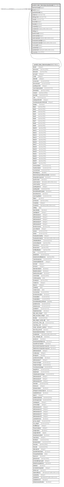

# public.stor_itemstandardrate

## Description

## Columns

| Name | Type | Default | Nullable | Children | Parents | Comment |
| ---- | ---- | ------- | -------- | -------- | ------- | ------- |
| standardrateid | integer | nextval('stor_itemstandardrate_standardrateid_seq'::regclass) | false |  |  |  |
| itemid | integer |  | true |  | [public.stor_itemmaster](public.stor_itemmaster.md) |  |
| applicabledate | date |  | true |  |  |  |
| costprice | numeric(17,5) | NULL::numeric | true |  |  |  |
| sellingprice | numeric(17,5) | NULL::numeric | true |  |  |  |
| rebate | numeric(17,5) | NULL::numeric | true |  |  |  |
| branchid | integer |  | true |  |  |  |
| deactive | boolean | false | true |  |  |  |
| createdby | integer |  | true |  |  |  |
| createdon | timestamp without time zone | now() | true |  |  |  |
| editlog | text |  | true |  |  |  |
| isauthorized | boolean | false | true |  |  |  |
| authorizedby | integer |  | true |  |  |  |
| authorizedon | timestamp without time zone |  | true |  |  |  |
| headauthorizedby | integer |  | true |  |  |  |
| headauthorizedon | timestamp without time zone |  | true |  |  |  |
| currencyid | integer |  | true |  |  |  |
| updatedby | integer |  | true |  |  |  |
| updatedon | timestamp(6) without time zone | NULL::timestamp without time zone | true |  |  |  |
| remarks | varchar(500) |  | true |  |  |  |

## Constraints

| Name | Type | Definition |
| ---- | ---- | ---------- |
| itemstandardrate_pkey | PRIMARY KEY | PRIMARY KEY (standardrateid) |
| itemstandardrate_fk | FOREIGN KEY | FOREIGN KEY (itemid) REFERENCES stor_itemmaster(itemid) ON UPDATE CASCADE |

## Indexes

| Name | Definition |
| ---- | ---------- |
| itemstandardrate_pkey | CREATE UNIQUE INDEX itemstandardrate_pkey ON public.stor_itemstandardrate USING btree (standardrateid) |

## Relations

---

> Generated by [tbls](https://github.com/k1LoW/tbls)
