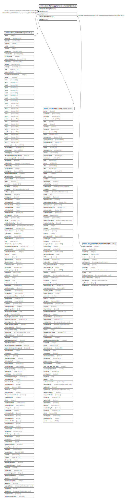

# public.stor_itemsupplierattributerating

## Description

## Columns

| Name | Type | Default | Nullable | Children | Parents | Comment |
| ---- | ---- | ------- | -------- | -------- | ------- | ------- |
| itmsuppatbutrattingid | integer | nextval('stor_itemsupplierattributerating_itmsuppatbutrattingid_seq'::regclass) | false |  |  |  |
| itemid | integer |  | false |  | [public.stor_itemmaster](public.stor_itemmaster.md) |  |
| partyid | integer |  | false |  | [public.comn_partymaster](public.comn_partymaster.md) |  |
| vendorattributeid | integer |  | false |  | [public.pur_vendorattributemaster](public.pur_vendorattributemaster.md) |  |
| ratting | integer |  | true |  |  |  |

## Constraints

| Name | Type | Definition |
| ---- | ---- | ---------- |
| itemsupplierattributeratting_pkey | PRIMARY KEY | PRIMARY KEY (itmsuppatbutrattingid) |
| itemsupplierattributeratting_fk1 | FOREIGN KEY | FOREIGN KEY (partyid) REFERENCES comn_partymaster(partyid) ON UPDATE CASCADE |
| itemsupplierattributeratting_fk | FOREIGN KEY | FOREIGN KEY (itemid) REFERENCES stor_itemmaster(itemid) ON UPDATE CASCADE |
| itemsupplierattributeratting_fk2 | FOREIGN KEY | FOREIGN KEY (vendorattributeid) REFERENCES pur_vendorattributemaster(vendorattributeid) ON UPDATE CASCADE |

## Indexes

| Name | Definition |
| ---- | ---------- |
| itemsupplierattributeratting_pkey | CREATE UNIQUE INDEX itemsupplierattributeratting_pkey ON public.stor_itemsupplierattributerating USING btree (itmsuppatbutrattingid) |

## Relations

---

> Generated by [tbls](https://github.com/k1LoW/tbls)
