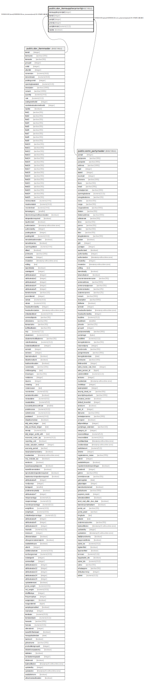

# public.stor_itemsupplierpriority

## Description

## Columns

| Name | Type | Default | Nullable | Children | Parents | Comment |
| ---- | ---- | ------- | -------- | -------- | ------- | ------- |
| itemsupplierpriorityid | integer | nextval('stor_itemsupplierpriority_itemsupplierpriorityid_seq'::regclass) | false |  |  |  |
| itemid | integer |  | true |  | [public.stor_itemmaster](public.stor_itemmaster.md) |  |
| partyid | integer |  | true |  | [public.comn_partymaster](public.comn_partymaster.md) |  |
| priority | integer |  | true |  |  |  |
| partyitemrate | numeric(12,2) |  | true |  |  |  |
| isactive | boolean |  | true |  |  |  |

## Constraints

| Name | Type | Definition |
| ---- | ---- | ---------- |
| itemsupplierpriority_pkey | PRIMARY KEY | PRIMARY KEY (itemsupplierpriorityid) |
| itemsupplierpriority_fk1 | FOREIGN KEY | FOREIGN KEY (partyid) REFERENCES comn_partymaster(partyid) ON UPDATE CASCADE |
| itemsupplierpriority_fk | FOREIGN KEY | FOREIGN KEY (itemid) REFERENCES stor_itemmaster(itemid) ON UPDATE CASCADE |

## Indexes

| Name | Definition |
| ---- | ---------- |
| itemsupplierpriority_pkey | CREATE UNIQUE INDEX itemsupplierpriority_pkey ON public.stor_itemsupplierpriority USING btree (itemsupplierpriorityid) |

## Relations

---

> Generated by [tbls](https://github.com/k1LoW/tbls)
