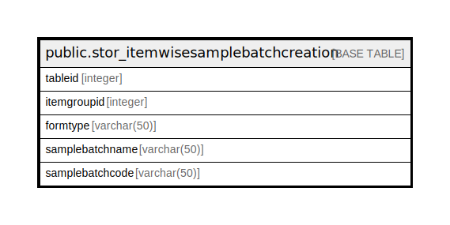

# public.stor_itemwisesamplebatchcreation

## Description

## Columns

| Name | Type | Default | Nullable | Children | Parents | Comment |
| ---- | ---- | ------- | -------- | -------- | ------- | ------- |
| tableid | integer | nextval('stor_itemwisesamplebatchcreation_tableid_seq'::regclass) | false |  |  |  |
| itemgroupid | integer |  | false |  |  |  |
| formtype | varchar(50) |  | true |  |  |  |
| samplebatchname | varchar(50) |  | true |  |  |  |
| samplebatchcode | varchar(50) | ''::character varying | false |  |  |  |

## Relations

---

> Generated by [tbls](https://github.com/k1LoW/tbls)
