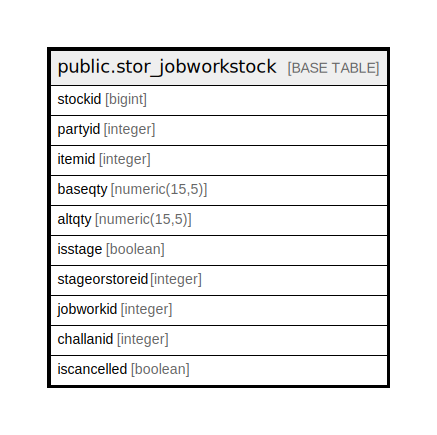

# public.stor_jobworkstock

## Description

## Columns

| Name | Type | Default | Nullable | Children | Parents | Comment |
| ---- | ---- | ------- | -------- | -------- | ------- | ------- |
| stockid | bigint | nextval('stor_jobworkstock_stockid_seq'::regclass) | false |  |  |  |
| partyid | integer |  | true |  |  |  |
| itemid | integer |  | true |  |  |  |
| baseqty | numeric(15,5) |  | true |  |  |  |
| altqty | numeric(15,5) |  | true |  |  |  |
| isstage | boolean | false | true |  |  |  |
| stageorstoreid | integer |  | true |  |  |  |
| jobworkid | integer |  | true |  |  |  |
| challanid | integer |  | true |  |  |  |
| iscancelled | boolean | false | true |  |  |  |

## Constraints

| Name | Type | Definition |
| ---- | ---- | ---------- |
| stor_jobworkstock_pkey | PRIMARY KEY | PRIMARY KEY (stockid) |

## Indexes

| Name | Definition |
| ---- | ---------- |
| stor_jobworkstock_pkey | CREATE UNIQUE INDEX stor_jobworkstock_pkey ON public.stor_jobworkstock USING btree (stockid) |

## Relations

---

> Generated by [tbls](https://github.com/k1LoW/tbls)
