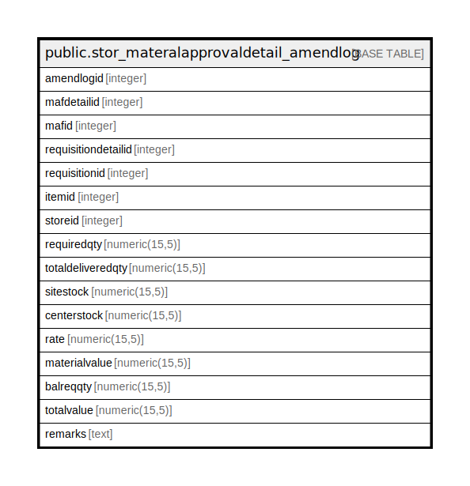

# public.stor_materalapprovaldetail_amendlog

## Description

## Columns

| Name | Type | Default | Nullable | Children | Parents | Comment |
| ---- | ---- | ------- | -------- | -------- | ------- | ------- |
| amendlogid | integer | nextval('stor_materalapprovaldetail_amendlog_amendlogid_seq'::regclass) | false |  |  |  |
| mafdetailid | integer |  | true |  |  |  |
| mafid | integer |  | true |  |  |  |
| requisitiondetailid | integer |  | true |  |  |  |
| requisitionid | integer |  | true |  |  |  |
| itemid | integer |  | true |  |  |  |
| storeid | integer |  | true |  |  |  |
| requiredqty | numeric(15,5) |  | true |  |  |  |
| totaldeliveredqty | numeric(15,5) |  | true |  |  |  |
| sitestock | numeric(15,5) |  | true |  |  |  |
| centerstock | numeric(15,5) |  | true |  |  |  |
| rate | numeric(15,5) |  | true |  |  |  |
| materialvalue | numeric(15,5) |  | true |  |  |  |
| balreqqty | numeric(15,5) |  | true |  |  |  |
| totalvalue | numeric(15,5) |  | true |  |  |  |
| remarks | text |  | true |  |  |  |

## Constraints

| Name | Type | Definition |
| ---- | ---- | ---------- |
| stor_materalapprovaldetail_amendlog_pkey | PRIMARY KEY | PRIMARY KEY (amendlogid) |

## Indexes

| Name | Definition |
| ---- | ---------- |
| stor_materalapprovaldetail_amendlog_pkey | CREATE UNIQUE INDEX stor_materalapprovaldetail_amendlog_pkey ON public.stor_materalapprovaldetail_amendlog USING btree (amendlogid) |

## Relations

---

> Generated by [tbls](https://github.com/k1LoW/tbls)
