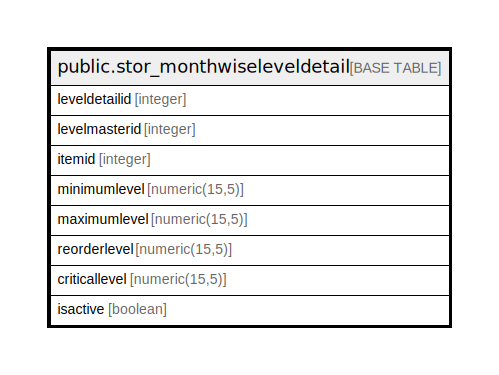

# public.stor_monthwiseleveldetail

## Description

## Columns

| Name | Type | Default | Nullable | Children | Parents | Comment |
| ---- | ---- | ------- | -------- | -------- | ------- | ------- |
| leveldetailid | integer | nextval('stor_monthwiseleveldetail_leveldetailid_seq'::regclass) | false |  |  |  |
| levelmasterid | integer |  | true |  |  |  |
| itemid | integer |  | true |  |  |  |
| minimumlevel | numeric(15,5) |  | true |  |  |  |
| maximumlevel | numeric(15,5) |  | true |  |  |  |
| reorderlevel | numeric(15,5) |  | true |  |  |  |
| criticallevel | numeric(15,5) |  | true |  |  |  |
| isactive | boolean | false | false |  |  |  |

## Constraints

| Name | Type | Definition |
| ---- | ---- | ---------- |
| stor_monthwiseleveldetail_pkey | PRIMARY KEY | PRIMARY KEY (leveldetailid) |

## Indexes

| Name | Definition |
| ---- | ---------- |
| stor_monthwiseleveldetail_pkey | CREATE UNIQUE INDEX stor_monthwiseleveldetail_pkey ON public.stor_monthwiseleveldetail USING btree (leveldetailid) |

## Relations

---

> Generated by [tbls](https://github.com/k1LoW/tbls)
