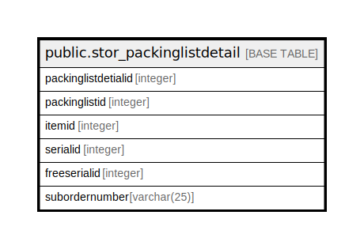

# public.stor_packinglistdetail

## Description

## Columns

| Name | Type | Default | Nullable | Children | Parents | Comment |
| ---- | ---- | ------- | -------- | -------- | ------- | ------- |
| packinglistdetialid | integer | nextval('stor_packinglistdetail_packinglistdetialid_seq'::regclass) | false |  |  |  |
| packinglistid | integer |  | true |  |  |  |
| itemid | integer |  | true |  |  |  |
| serialid | integer |  | true |  |  |  |
| freeserialid | integer |  | true |  |  |  |
| subordernumber | varchar(25) | ''::character varying | true |  |  |  |

## Constraints

| Name | Type | Definition |
| ---- | ---- | ---------- |
| stor_packinglistdetail_pkey | PRIMARY KEY | PRIMARY KEY (packinglistdetialid) |

## Indexes

| Name | Definition |
| ---- | ---------- |
| stor_packinglistdetail_pkey | CREATE UNIQUE INDEX stor_packinglistdetail_pkey ON public.stor_packinglistdetail USING btree (packinglistdetialid) |

## Relations

---

> Generated by [tbls](https://github.com/k1LoW/tbls)
