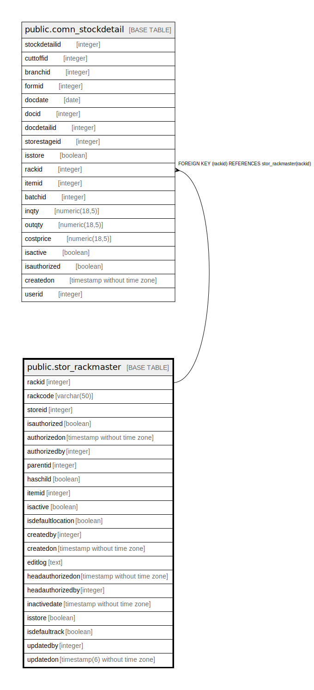

# public.stor_rackmaster

## Description

## Columns

| Name | Type | Default | Nullable | Children | Parents | Comment |
| ---- | ---- | ------- | -------- | -------- | ------- | ------- |
| rackid | integer | nextval('stor_rackmaster_rackid_seq'::regclass) | false | [public.comn_stockdetail](public.comn_stockdetail.md) |  |  |
| rackcode | varchar(50) |  | false |  |  |  |
| storeid | integer |  | false |  |  |  |
| isauthorized | boolean | false | false |  |  |  |
| authorizedon | timestamp without time zone |  | true |  |  |  |
| authorizedby | integer |  | true |  |  |  |
| parentid | integer |  | true |  |  |  |
| haschild | boolean | false | false |  |  |  |
| itemid | integer |  | true |  |  |  |
| isactive | boolean | true | false |  |  |  |
| isdefaultlocation | boolean | false | false |  |  |  |
| createdby | integer |  | true |  |  |  |
| createdon | timestamp without time zone | now() | true |  |  |  |
| editlog | text |  | true |  |  |  |
| inactivedate | timestamp without time zone |  | true |  |  |  |
| headauthorizedon | timestamp without time zone |  | true |  |  |  |
| headauthorizedby | integer |  | true |  |  |  |
| isstore | boolean | true | false |  |  |  |
| isdefaultrack | boolean | false | false |  |  | Only one rack must be true under one store/stage |
| updatedby | integer |  | true |  |  |  |
| updatedon | timestamp(6) without time zone | NULL::timestamp without time zone | true |  |  |  |

## Constraints

| Name | Type | Definition |
| ---- | ---- | ---------- |
| rackmaster_pkey | PRIMARY KEY | PRIMARY KEY (rackid) |
| rackmaster_rackcode_key | UNIQUE | UNIQUE (rackcode, storeid) |

## Indexes

| Name | Definition |
| ---- | ---------- |
| rackmaster_pkey | CREATE UNIQUE INDEX rackmaster_pkey ON public.stor_rackmaster USING btree (rackid) |
| rackmaster_rackcode_key | CREATE UNIQUE INDEX rackmaster_rackcode_key ON public.stor_rackmaster USING btree (rackcode, storeid) |

## Relations

---

> Generated by [tbls](https://github.com/k1LoW/tbls)
