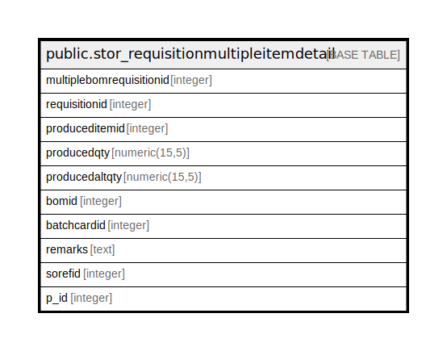

# public.stor_requisitionmultipleitemdetail

## Description

## Columns

| Name | Type | Default | Nullable | Children | Parents | Comment |
| ---- | ---- | ------- | -------- | -------- | ------- | ------- |
| multiplebomrequisitionid | integer | nextval('stor_requisitionmultipleitemdetail_multiplebomrequisitionid_seq'::regclass) | false |  |  |  |
| requisitionid | integer |  | false |  |  |  |
| produceditemid | integer |  | true |  |  |  |
| producedqty | numeric(15,5) | NULL::numeric | true |  |  |  |
| producedaltqty | numeric(15,5) | NULL::numeric | true |  |  |  |
| bomid | integer |  | true |  |  |  |
| batchcardid | integer |  | true |  |  |  |
| remarks | text |  | true |  |  |  |
| sorefid | integer |  | true |  |  |  |
| p_id | integer |  | true |  |  |  |

## Constraints

| Name | Type | Definition |
| ---- | ---- | ---------- |
| stor_requisitionmultipleitemdetail_pkey | PRIMARY KEY | PRIMARY KEY (multiplebomrequisitionid) |

## Indexes

| Name | Definition |
| ---- | ---------- |
| stor_requisitionmultipleitemdetail_pkey | CREATE UNIQUE INDEX stor_requisitionmultipleitemdetail_pkey ON public.stor_requisitionmultipleitemdetail USING btree (multiplebomrequisitionid) |
| Index_SRN_MulDet_ReqID | CREATE INDEX "Index_SRN_MulDet_ReqID" ON public.stor_requisitionmultipleitemdetail USING btree (requisitionid) |

## Relations

---

> Generated by [tbls](https://github.com/k1LoW/tbls)
