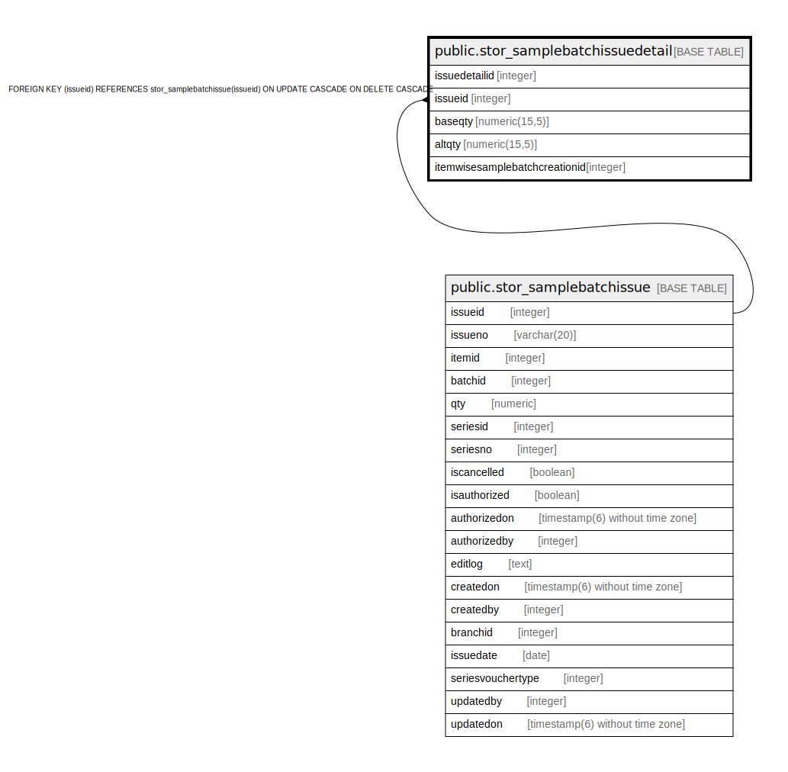

# public.stor_samplebatchissuedetail

## Description

## Columns

| Name | Type | Default | Nullable | Children | Parents | Comment |
| ---- | ---- | ------- | -------- | -------- | ------- | ------- |
| issuedetailid | integer | nextval('stor_samplebatchissuedetail_issuedetailid_seq'::regclass) | false |  |  |  |
| issueid | integer |  | true |  | [public.stor_samplebatchissue](public.stor_samplebatchissue.md) |  |
| baseqty | numeric(15,5) |  | true |  |  |  |
| altqty | numeric(15,5) |  | true |  |  |  |
| itemwisesamplebatchcreationid | integer |  | true |  |  |  |

## Constraints

| Name | Type | Definition |
| ---- | ---- | ---------- |
| stor_samplebatch_issuedetail | PRIMARY KEY | PRIMARY KEY (issuedetailid) |
| stor_samplebatchissuedetail_fk | FOREIGN KEY | FOREIGN KEY (issueid) REFERENCES stor_samplebatchissue(issueid) ON UPDATE CASCADE ON DELETE CASCADE |

## Indexes

| Name | Definition |
| ---- | ---------- |
| stor_samplebatch_issuedetail | CREATE UNIQUE INDEX stor_samplebatch_issuedetail ON public.stor_samplebatchissuedetail USING btree (issuedetailid) |

## Relations

---

> Generated by [tbls](https://github.com/k1LoW/tbls)
