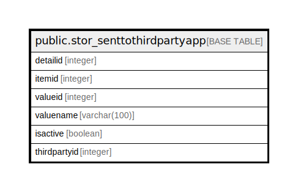

# public.stor_senttothirdpartyapp

## Description

## Columns

| Name | Type | Default | Nullable | Children | Parents | Comment |
| ---- | ---- | ------- | -------- | -------- | ------- | ------- |
| detailid | integer | nextval('stor_senttothirdpartyapp_detailid_seq'::regclass) | false |  |  |  |
| itemid | integer |  | true |  |  |  |
| valueid | integer |  | true |  |  |  |
| valuename | varchar(100) |  | true |  |  |  |
| isactive | boolean |  | true |  |  |  |
| thirdpartyid | integer | 0 | true |  |  |  |

## Constraints

| Name | Type | Definition |
| ---- | ---- | ---------- |
| stor_senttothirdpartyapp_pkey | PRIMARY KEY | PRIMARY KEY (detailid) |

## Indexes

| Name | Definition |
| ---- | ---------- |
| stor_senttothirdpartyapp_pkey | CREATE UNIQUE INDEX stor_senttothirdpartyapp_pkey ON public.stor_senttothirdpartyapp USING btree (detailid) |

## Relations

---

> Generated by [tbls](https://github.com/k1LoW/tbls)
