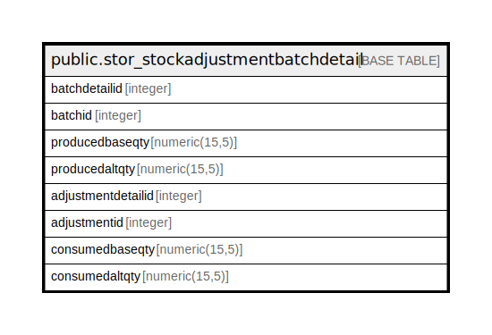

# public.stor_stockadjustmentbatchdetail

## Description

## Columns

| Name | Type | Default | Nullable | Children | Parents | Comment |
| ---- | ---- | ------- | -------- | -------- | ------- | ------- |
| batchdetailid | integer | nextval('stor_stockadjustmentbatchdetail_batchdetailid_seq'::regclass) | false |  |  |  |
| batchid | integer |  | true |  |  |  |
| producedbaseqty | numeric(15,5) |  | true |  |  |  |
| producedaltqty | numeric(15,5) |  | true |  |  |  |
| adjustmentdetailid | integer |  | true |  |  |  |
| adjustmentid | integer |  | true |  |  |  |
| consumedbaseqty | numeric(15,5) |  | true |  |  |  |
| consumedaltqty | numeric(15,5) |  | true |  |  |  |

## Indexes

| Name | Definition |
| ---- | ---------- |
| Index_ST_BatDet_STID | CREATE INDEX "Index_ST_BatDet_STID" ON public.stor_stockadjustmentbatchdetail USING btree (adjustmentdetailid) |
| Index_ST_BatDet_STIDDetID | CREATE INDEX "Index_ST_BatDet_STIDDetID" ON public.stor_stockadjustmentbatchdetail USING btree (adjustmentid, adjustmentdetailid) |

## Triggers

| Name | Definition |
| ---- | ---------- |
| stockadjustmentbatchdetail_trg_checkstock | CREATE TRIGGER stockadjustmentbatchdetail_trg_checkstock BEFORE INSERT ON public.stor_stockadjustmentbatchdetail FOR EACH ROW EXECUTE FUNCTION trg_checkstock() |

## Relations

---

> Generated by [tbls](https://github.com/k1LoW/tbls)
