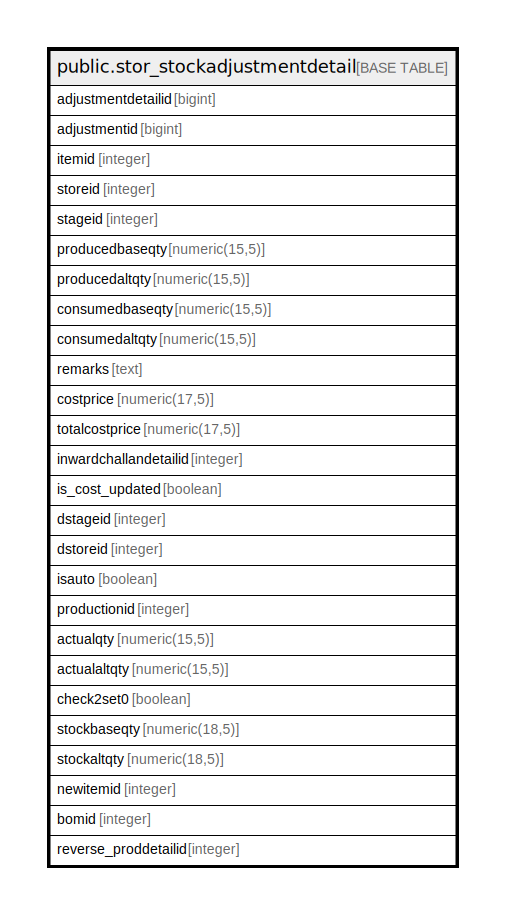

# public.stor_stockadjustmentdetail

## Description

## Columns

| Name | Type | Default | Nullable | Children | Parents | Comment |
| ---- | ---- | ------- | -------- | -------- | ------- | ------- |
| adjustmentdetailid | bigint | nextval('stor_stockadjustmentdetail_adjustmentdetailid_seq'::regclass) | false |  |  |  |
| adjustmentid | bigint |  | true |  |  |  |
| itemid | integer |  | true |  |  |  |
| storeid | integer |  | true |  |  |  |
| stageid | integer |  | true |  |  |  |
| producedbaseqty | numeric(15,5) | 0 | true |  |  |  |
| producedaltqty | numeric(15,5) |  | true |  |  |  |
| consumedbaseqty | numeric(15,5) | 0 | true |  |  |  |
| consumedaltqty | numeric(15,5) |  | true |  |  |  |
| remarks | text |  | true |  |  |  |
| costprice | numeric(17,5) | 0 | true |  |  |  |
| totalcostprice | numeric(17,5) | 0 | true |  |  |  |
| inwardchallandetailid | integer |  | true |  |  |  |
| is_cost_updated | boolean | true | false |  |  |  |
| dstageid | integer |  | true |  |  |  |
| dstoreid | integer |  | true |  |  |  |
| isauto | boolean | false | true |  |  |  |
| productionid | integer |  | true |  |  |  |
| actualqty | numeric(15,5) |  | true |  |  | Add on 15-Sep-2014 for Physical Stock Verification |
| actualaltqty | numeric(15,5) |  | true |  |  | Add on 15-Sep-2014 for Physical Stock Verification |
| check2set0 | boolean | false | true |  |  | Add on 15-Sep-2014 for Physical Stock Verification |
| stockbaseqty | numeric(18,5) |  | true |  |  |  |
| stockaltqty | numeric(18,5) |  | true |  |  |  |
| newitemid | integer | 0 | true |  |  |  |
| bomid | integer | 0 | true |  |  |  |
| reverse_proddetailid | integer | 0 | true |  |  |  |

## Constraints

| Name | Type | Definition |
| ---- | ---- | ---------- |
| stor_stockadjustmentdetail_pkey | PRIMARY KEY | PRIMARY KEY (adjustmentdetailid) |

## Indexes

| Name | Definition |
| ---- | ---------- |
| stor_stockadjustmentdetail_pkey | CREATE UNIQUE INDEX stor_stockadjustmentdetail_pkey ON public.stor_stockadjustmentdetail USING btree (adjustmentdetailid) |
| Index_ST_Det_STID | CREATE INDEX "Index_ST_Det_STID" ON public.stor_stockadjustmentdetail USING btree (adjustmentid) |
| in_stkadj_det | CREATE INDEX in_stkadj_det ON public.stor_stockadjustmentdetail USING btree (adjustmentid, adjustmentdetailid, itemid, producedbaseqty, consumedbaseqty, producedaltqty, consumedaltqty) |

## Triggers

| Name | Definition |
| ---- | ---------- |
| stockadjustmentdetail_trg_checkstock | CREATE TRIGGER stockadjustmentdetail_trg_checkstock BEFORE INSERT ON public.stor_stockadjustmentdetail FOR EACH ROW EXECUTE FUNCTION trg_checkstock() |
| tgr_physicalstock_editlog | CREATE TRIGGER tgr_physicalstock_editlog BEFORE UPDATE ON public.stor_stockadjustmentdetail FOR EACH ROW EXECUTE FUNCTION tgr_physicalstock_editlog() |

## Relations

---

> Generated by [tbls](https://github.com/k1LoW/tbls)
