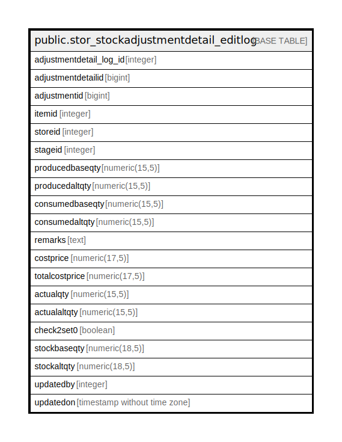

# public.stor_stockadjustmentdetail_editlog

## Description

## Columns

| Name | Type | Default | Nullable | Children | Parents | Comment |
| ---- | ---- | ------- | -------- | -------- | ------- | ------- |
| adjustmentdetail_log_id | integer | nextval('stor_stockadjustmentdetail_editlog_adjustmentdetail_log_id_seq'::regclass) | false |  |  |  |
| adjustmentdetailid | bigint |  | true |  |  |  |
| adjustmentid | bigint |  | true |  |  |  |
| itemid | integer |  | true |  |  |  |
| storeid | integer |  | true |  |  |  |
| stageid | integer |  | true |  |  |  |
| producedbaseqty | numeric(15,5) |  | true |  |  |  |
| producedaltqty | numeric(15,5) |  | true |  |  |  |
| consumedbaseqty | numeric(15,5) |  | true |  |  |  |
| consumedaltqty | numeric(15,5) |  | true |  |  |  |
| remarks | text |  | true |  |  |  |
| costprice | numeric(17,5) | 0 | true |  |  |  |
| totalcostprice | numeric(17,5) | 0 | true |  |  |  |
| actualqty | numeric(15,5) |  | true |  |  |  |
| actualaltqty | numeric(15,5) |  | true |  |  |  |
| check2set0 | boolean | false | true |  |  |  |
| stockbaseqty | numeric(18,5) |  | true |  |  |  |
| stockaltqty | numeric(18,5) |  | true |  |  |  |
| updatedby | integer |  | true |  |  |  |
| updatedon | timestamp without time zone | now() | true |  |  |  |

## Constraints

| Name | Type | Definition |
| ---- | ---- | ---------- |
| stor_stockadjustmentdetail_editlog_pkey | PRIMARY KEY | PRIMARY KEY (adjustmentdetail_log_id) |

## Indexes

| Name | Definition |
| ---- | ---------- |
| stor_stockadjustmentdetail_editlog_pkey | CREATE UNIQUE INDEX stor_stockadjustmentdetail_editlog_pkey ON public.stor_stockadjustmentdetail_editlog USING btree (adjustmentdetail_log_id) |

## Relations

---

> Generated by [tbls](https://github.com/k1LoW/tbls)
