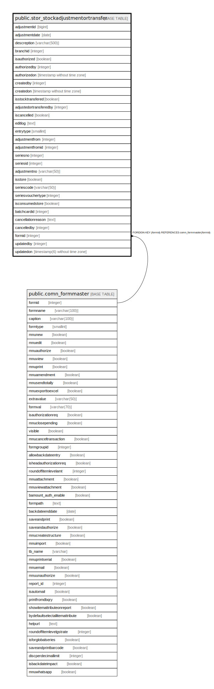

# public.stor_stockadjustmentortransfer

## Description

## Columns

| Name | Type | Default | Nullable | Children | Parents | Comment |
| ---- | ---- | ------- | -------- | -------- | ------- | ------- |
| adjustmentid | bigint | nextval(('"public"."stor_stockadjustmentortransfer_adjustmentid_seq"'::text)::regclass) | false |  |  |  |
| adjustmentdate | date |  | true |  |  |  |
| descreption | varchar(500) |  | true |  |  |  |
| branchid | integer |  | true |  |  |  |
| isauthorized | boolean | false | false |  |  |  |
| authorizedby | integer |  | true |  |  |  |
| authorizedon | timestamp without time zone |  | true |  |  |  |
| createdby | integer |  | true |  |  |  |
| createdon | timestamp without time zone | now() | true |  |  |  |
| isstocktransfered | boolean | false | false |  |  |  |
| adjustedortransferedby | integer |  | true |  |  |  |
| iscancelled | boolean | false | true |  |  |  |
| editlog | text |  | true |  |  |  |
| entrytype | smallint | 0 | true |  |  | 0  -Stock Adjustment 1  -Stock Transfer 2  -Rejection Return to Rejection Store 3  -Physical Stock Verification 4  -Production Jounal 5  -Material Descrepancies Adjustment 6  -Dismental of Produced Serial 7  -Stage Journal for Batchcard 8  -Repacking 9  -Reprocessing 10 -MIDR 11 -Production Adjustment 12 -Pick List Master - Transfer 13 -Packing List Master - Transfer 14 -Serial Exchange 15 -Stock Dump 16 -Sample QC 17-DGrade Stock Adjustment |
| adjustmentfrom | integer |  | true |  |  | --0 for Stock Transfer --1 for deliverynote --2 for production --3 for jobwork --4 for Stock Adjust --5 Rejection from IAM --6 Adjustment for Auto DN/CN against Sales invoice in Linked Branch --7 for Auto Stock Journal from Production (Trading) |
| adjustmentfromid | integer |  | true |  |  |  |
| seriesno | integer |  | true |  |  |  |
| seriesid | integer |  | true |  |  |  |
| adjustmentno | varchar(50) |  | true |  |  | Generate No. on 15-Sep-2014 for Physical Stock Verification |
| isstore | boolean | true | true |  |  |  |
| seriescode | varchar(50) |  | true |  |  |  |
| seriesvouchertype | integer |  | true |  |  |  |
| isconsumedstore | boolean | false | true |  |  |  |
| batchcardid | integer |  | true |  |  |  |
| cancellationreason | text |  | true |  |  |  |
| cancelledby | integer |  | true |  |  |  |
| formid | integer | 85 | false |  | [public.comn_formmaster](public.comn_formmaster.md) |  |
| updatedby | integer |  | true |  |  |  |
| updatedon | timestamp(6) without time zone | NULL::timestamp without time zone | true |  |  |  |

## Constraints

| Name | Type | Definition |
| ---- | ---- | ---------- |
| stor_stockadjustmentortransfer_formid_fkey | FOREIGN KEY | FOREIGN KEY (formid) REFERENCES comn_formmaster(formid) |
| stor_stockadjustment_pkey | PRIMARY KEY | PRIMARY KEY (adjustmentid) |

## Indexes

| Name | Definition |
| ---- | ---------- |
| stor_stockadjustment_pkey | CREATE UNIQUE INDEX stor_stockadjustment_pkey ON public.stor_stockadjustmentortransfer USING btree (adjustmentid) |
| satt_adjustmentid | CREATE INDEX satt_adjustmentid ON public.stor_stockadjustmentortransfer USING btree (adjustmentid) |
| satt_branchid | CREATE INDEX satt_branchid ON public.stor_stockadjustmentortransfer USING btree (branchid) |
| ui_adj_no | CREATE UNIQUE INDEX ui_adj_no ON public.stor_stockadjustmentortransfer USING btree (branchid, adjustmentdate, adjustmentno, entrytype, formid) WHERE (adjustmentid > 0) |

## Triggers

| Name | Definition |
| ---- | ---------- |
| tgr_updatecostdate_stkadj | CREATE TRIGGER tgr_updatecostdate_stkadj AFTER INSERT OR UPDATE ON public.stor_stockadjustmentortransfer FOR EACH ROW EXECUTE FUNCTION tgr_updatecostdate() |

## Relations

---

> Generated by [tbls](https://github.com/k1LoW/tbls)
