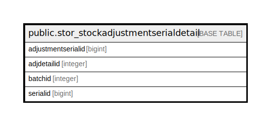

# public.stor_stockadjustmentserialdetail

## Description

## Columns

| Name | Type | Default | Nullable | Children | Parents | Comment |
| ---- | ---- | ------- | -------- | -------- | ------- | ------- |
| adjustmentserialid | bigint | nextval('stor_stockadjustmentserialdetail_adjustmentserialid_seq'::regclass) | false |  |  |  |
| adjdetailid | integer |  | true |  |  |  |
| batchid | integer |  | true |  |  |  |
| serialid | bigint |  | true |  |  |  |

## Constraints

| Name | Type | Definition |
| ---- | ---- | ---------- |
| stor_stockadjustmentserialdetail_pkey | PRIMARY KEY | PRIMARY KEY (adjustmentserialid) |

## Indexes

| Name | Definition |
| ---- | ---------- |
| stor_stockadjustmentserialdetail_pkey | CREATE UNIQUE INDEX stor_stockadjustmentserialdetail_pkey ON public.stor_stockadjustmentserialdetail USING btree (adjustmentserialid) |
| Index_ST_SerDet_STID | CREATE INDEX "Index_ST_SerDet_STID" ON public.stor_stockadjustmentserialdetail USING btree (adjdetailid) |

## Triggers

| Name | Definition |
| ---- | ---------- |
| serialhistorydata | CREATE TRIGGER serialhistorydata BEFORE INSERT ON public.stor_stockadjustmentserialdetail FOR EACH ROW EXECUTE FUNCTION tgr_serialhistory() |
| stockadjustmentserial_trg_check | CREATE TRIGGER stockadjustmentserial_trg_check BEFORE INSERT ON public.stor_stockadjustmentserialdetail FOR EACH ROW EXECUTE FUNCTION trg_checkstock() |

## Relations

---

> Generated by [tbls](https://github.com/k1LoW/tbls)
