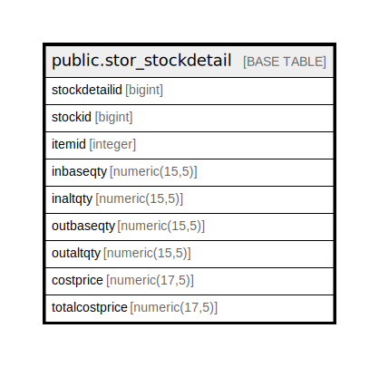

# public.stor_stockdetail

## Description

## Columns

| Name | Type | Default | Nullable | Children | Parents | Comment |
| ---- | ---- | ------- | -------- | -------- | ------- | ------- |
| stockdetailid | bigint | nextval('stor_stockdetail_stockdetailid_seq'::regclass) | false |  |  |  |
| stockid | bigint |  | true |  |  |  |
| itemid | integer |  | true |  |  |  |
| inbaseqty | numeric(15,5) |  | true |  |  |  |
| inaltqty | numeric(15,5) |  | true |  |  |  |
| outbaseqty | numeric(15,5) |  | true |  |  |  |
| outaltqty | numeric(15,5) |  | true |  |  |  |
| costprice | numeric(17,5) | 0 | true |  |  |  |
| totalcostprice | numeric(17,5) | 0 | true |  |  |  |

## Constraints

| Name | Type | Definition |
| ---- | ---- | ---------- |
| stor_stockdetail_pkey | PRIMARY KEY | PRIMARY KEY (stockdetailid) |

## Indexes

| Name | Definition |
| ---- | ---------- |
| stor_stockdetail_pkey | CREATE UNIQUE INDEX stor_stockdetail_pkey ON public.stor_stockdetail USING btree (stockdetailid) |

## Relations

---

> Generated by [tbls](https://github.com/k1LoW/tbls)
