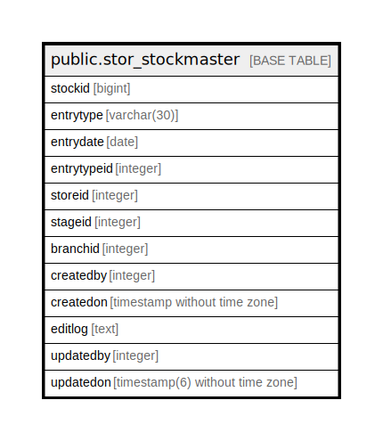

# public.stor_stockmaster

## Description

## Columns

| Name | Type | Default | Nullable | Children | Parents | Comment |
| ---- | ---- | ------- | -------- | -------- | ------- | ------- |
| stockid | bigint | nextval('stor_stockmaster_stockid_seq'::regclass) | false |  |  |  |
| entrytype | varchar(30) |  | true |  |  |  |
| entrydate | date |  | true |  |  |  |
| entrytypeid | integer |  | true |  |  |  |
| storeid | integer |  | true |  |  |  |
| stageid | integer |  | true |  |  |  |
| branchid | integer |  | true |  |  |  |
| createdby | integer |  | true |  |  |  |
| createdon | timestamp without time zone | now() | true |  |  |  |
| editlog | text |  | true |  |  |  |
| updatedby | integer |  | true |  |  |  |
| updatedon | timestamp(6) without time zone | NULL::timestamp without time zone | true |  |  |  |

## Constraints

| Name | Type | Definition |
| ---- | ---- | ---------- |
| stor_stockmaster_pkey | PRIMARY KEY | PRIMARY KEY (stockid) |

## Indexes

| Name | Definition |
| ---- | ---------- |
| stor_stockmaster_pkey | CREATE UNIQUE INDEX stor_stockmaster_pkey ON public.stor_stockmaster USING btree (stockid) |

## Relations

---

> Generated by [tbls](https://github.com/k1LoW/tbls)
