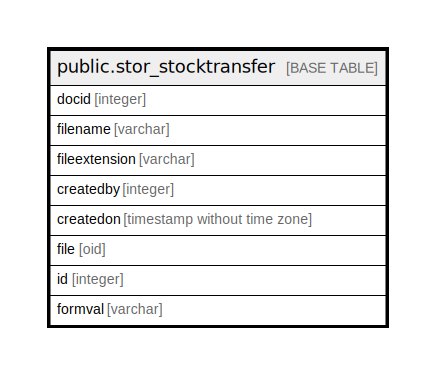

# public.stor_stocktransfer

## Description

## Columns

| Name | Type | Default | Nullable | Children | Parents | Comment |
| ---- | ---- | ------- | -------- | -------- | ------- | ------- |
| docid | integer | nextval('stor_stocktransfer_docid_seq'::regclass) | false |  |  |  |
| filename | varchar |  | true |  |  |  |
| fileextension | varchar |  | true |  |  |  |
| createdby | integer |  | true |  |  |  |
| createdon | timestamp without time zone | now() | true |  |  |  |
| file | oid |  | true |  |  |  |
| id | integer |  | true |  |  |  |
| formval | varchar |  | true |  |  |  |

## Constraints

| Name | Type | Definition |
| ---- | ---- | ---------- |
| stor_stocktransfer_pkey | PRIMARY KEY | PRIMARY KEY (docid) |

## Indexes

| Name | Definition |
| ---- | ---------- |
| stor_stocktransfer_pkey | CREATE UNIQUE INDEX stor_stocktransfer_pkey ON public.stor_stocktransfer USING btree (docid) |

## Relations

---

> Generated by [tbls](https://github.com/k1LoW/tbls)
