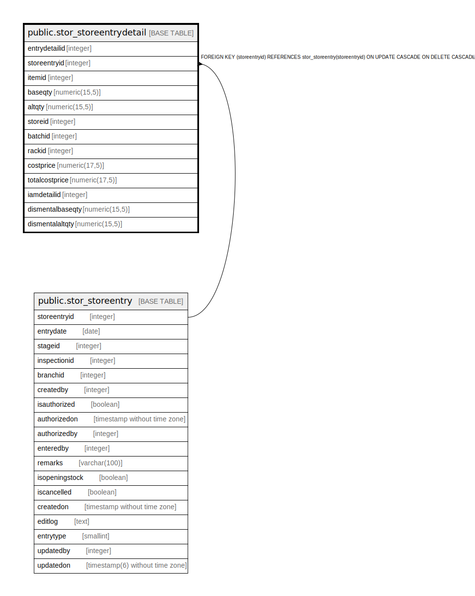

# public.stor_storeentrydetail

## Description

## Columns

| Name | Type | Default | Nullable | Children | Parents | Comment |
| ---- | ---- | ------- | -------- | -------- | ------- | ------- |
| entrydetailid | integer | nextval('stor_storeentrydetail_entrydetailid_seq'::regclass) | false |  |  |  |
| storeentryid | integer |  | true |  | [public.stor_storeentry](public.stor_storeentry.md) |  |
| itemid | integer |  | true |  |  |  |
| baseqty | numeric(15,5) |  | true |  |  |  |
| altqty | numeric(15,5) |  | true |  |  |  |
| storeid | integer |  | true |  |  |  |
| batchid | integer |  | true |  |  |  |
| rackid | integer |  | true |  |  |  |
| costprice | numeric(17,5) |  | true |  |  |  |
| totalcostprice | numeric(17,5) | 0 | true |  |  |  |
| iamdetailid | integer |  | true |  |  | inspectiondetailid  invoicedetailid IF entry type is 13 (Trading Excise Opening). |
| dismentalbaseqty | numeric(15,5) | 0 | true |  |  |  |
| dismentalaltqty | numeric(15,5) | 0 | true |  |  |  |

## Constraints

| Name | Type | Definition |
| ---- | ---- | ---------- |
| stor_storeentrydetail_fk | FOREIGN KEY | FOREIGN KEY (storeentryid) REFERENCES stor_storeentry(storeentryid) ON UPDATE CASCADE ON DELETE CASCADE |
| stor_storeentrydetail_pkey | PRIMARY KEY | PRIMARY KEY (entrydetailid) |

## Indexes

| Name | Definition |
| ---- | ---------- |
| stor_storeentrydetail_pkey | CREATE UNIQUE INDEX stor_storeentrydetail_pkey ON public.stor_storeentrydetail USING btree (entrydetailid) |
| Index_SE_Det_SEID | CREATE INDEX "Index_SE_Det_SEID" ON public.stor_storeentrydetail USING btree (storeentryid) |
| in_strentdet | CREATE INDEX in_strentdet ON public.stor_storeentrydetail USING btree (storeentryid, entrydetailid, itemid, storeid, baseqty, altqty, costprice) |

## Relations

---

> Generated by [tbls](https://github.com/k1LoW/tbls)
