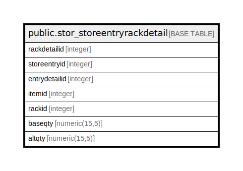

# public.stor_storeentryrackdetail

## Description

## Columns

| Name | Type | Default | Nullable | Children | Parents | Comment |
| ---- | ---- | ------- | -------- | -------- | ------- | ------- |
| rackdetailid | integer | nextval('stor_storeentryrackdetail_rackdetailid_seq'::regclass) | false |  |  |  |
| storeentryid | integer |  | true |  |  |  |
| entrydetailid | integer |  | true |  |  |  |
| itemid | integer |  | true |  |  |  |
| rackid | integer |  | true |  |  |  |
| baseqty | numeric(15,5) |  | true |  |  |  |
| altqty | numeric(15,5) |  | true |  |  |  |

## Constraints

| Name | Type | Definition |
| ---- | ---- | ---------- |
| stor_storeentryrackdetail_pkey | PRIMARY KEY | PRIMARY KEY (rackdetailid) |

## Indexes

| Name | Definition |
| ---- | ---------- |
| stor_storeentryrackdetail_pkey | CREATE UNIQUE INDEX stor_storeentryrackdetail_pkey ON public.stor_storeentryrackdetail USING btree (rackdetailid) |
| Index_SE_RacDet_SEID | CREATE INDEX "Index_SE_RacDet_SEID" ON public.stor_storeentryrackdetail USING btree (storeentryid) |

## Relations

---

> Generated by [tbls](https://github.com/k1LoW/tbls)
