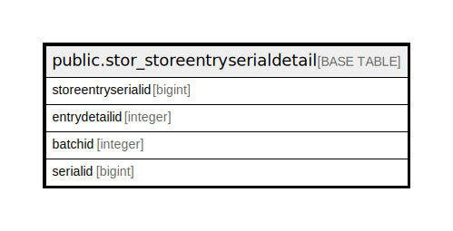

# public.stor_storeentryserialdetail

## Description

## Columns

| Name | Type | Default | Nullable | Children | Parents | Comment |
| ---- | ---- | ------- | -------- | -------- | ------- | ------- |
| storeentryserialid | bigint | nextval('stor_storeentryserialdetail_storeentryserialid_seq'::regclass) | false |  |  |  |
| entrydetailid | integer |  | true |  |  |  |
| batchid | integer |  | true |  |  |  |
| serialid | bigint |  | true |  |  |  |

## Constraints

| Name | Type | Definition |
| ---- | ---- | ---------- |
| stor_storeentryserialdetail_pkey | PRIMARY KEY | PRIMARY KEY (storeentryserialid) |

## Indexes

| Name | Definition |
| ---- | ---------- |
| stor_storeentryserialdetail_pkey | CREATE UNIQUE INDEX stor_storeentryserialdetail_pkey ON public.stor_storeentryserialdetail USING btree (storeentryserialid) |
| Index_SE_SerDet_SEID | CREATE INDEX "Index_SE_SerDet_SEID" ON public.stor_storeentryserialdetail USING btree (entrydetailid) |

## Relations

---

> Generated by [tbls](https://github.com/k1LoW/tbls)
