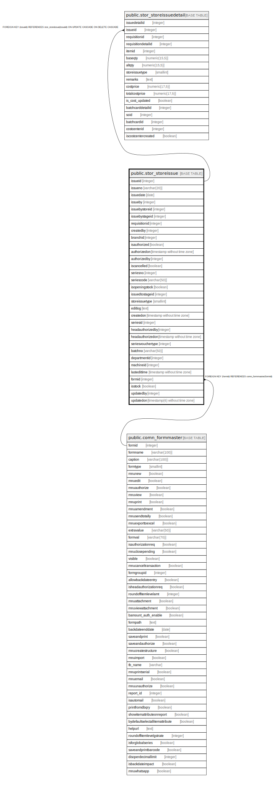

# public.stor_storeissue

## Description

## Columns

| Name | Type | Default | Nullable | Children | Parents | Comment |
| ---- | ---- | ------- | -------- | -------- | ------- | ------- |
| issueid | integer | nextval('stor_storeissue_issueid_seq'::regclass) | false | [public.stor_storeissuedetail](public.stor_storeissuedetail.md) |  |  |
| issueno | varchar(20) |  | false |  |  |  |
| issuedate | date |  | true |  |  |  |
| issueby | integer |  | true |  |  |  |
| issuebystoreid | integer |  | true |  |  |  |
| issuebystageid | integer |  | true |  |  |  |
| requisitionid | integer |  | true |  |  |  |
| createdby | integer |  | true |  |  |  |
| branchid | integer |  | true |  |  |  |
| isauthorized | boolean | false | false |  |  |  |
| authorizedon | timestamp without time zone |  | true |  |  |  |
| authorizedby | integer |  | true |  |  |  |
| iscancelled | boolean | false | false |  |  |  |
| seriesno | integer |  | true |  |  |  |
| seriescode | varchar(50) |  | true |  |  |  |
| isopeningstock | boolean | false | false |  |  |  |
| issuedtostageid | integer |  | true |  |  |  |
| storeissuetype | smallint | 1 | true |  |  | storeissue=1 opening Stock=2 job work=3 Work Order=4  |
| editlog | text |  | true |  |  |  |
| createdon | timestamp without time zone | now() | true |  |  |  |
| seriesid | integer |  | true |  |  |  |
| headauthorizedby | integer |  | true |  |  |  |
| headauthorizedon | timestamp without time zone |  | true |  |  |  |
| seriesvouchertype | integer | 0 | true |  |  |  |
| batchno | varchar(50) |  | true |  |  |  |
| departmentid | integer |  | true |  |  |  |
| machineid | integer |  | true |  |  |  |
| lastedittime | timestamp without time zone | now() | false |  |  |  |
| formid | integer | 44 | false |  | [public.comn_formmaster](public.comn_formmaster.md) |  |
| isstock | boolean | false | false |  |  |  |
| updatedby | integer |  | true |  |  |  |
| updatedon | timestamp(6) without time zone | NULL::timestamp without time zone | true |  |  |  |

## Constraints

| Name | Type | Definition |
| ---- | ---- | ---------- |
| stor_storeissue_formid_fkey | FOREIGN KEY | FOREIGN KEY (formid) REFERENCES comn_formmaster(formid) |
| stor_storeissue_pkey | PRIMARY KEY | PRIMARY KEY (issueid) |

## Indexes

| Name | Definition |
| ---- | ---------- |
| stor_storeissue_pkey | CREATE UNIQUE INDEX stor_storeissue_pkey ON public.stor_storeissue USING btree (issueid) |
| Index_StrIsu_StgStk2 | CREATE INDEX "Index_StrIsu_StgStk2" ON public.stor_storeissue USING btree (branchid, issuedate, iscancelled, isauthorized, isopeningstock, issuedtostageid, issueid) |
| ui_storeisu_no | CREATE UNIQUE INDEX ui_storeisu_no ON public.stor_storeissue USING btree (branchid, issuedate, issueno) WHERE (issueid > 75680) |

## Relations

---

> Generated by [tbls](https://github.com/k1LoW/tbls)
