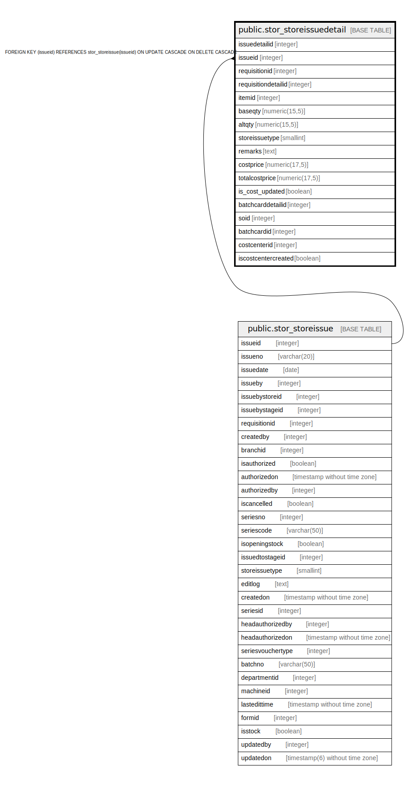

# public.stor_storeissuedetail

## Description

## Columns

| Name | Type | Default | Nullable | Children | Parents | Comment |
| ---- | ---- | ------- | -------- | -------- | ------- | ------- |
| issuedetailid | integer | nextval('stor_storeissuedetail_issuedetailid_seq'::regclass) | false |  |  |  |
| issueid | integer |  | true |  | [public.stor_storeissue](public.stor_storeissue.md) |  |
| requisitionid | integer |  | true |  |  |  |
| requisitiondetailid | integer |  | true |  |  |  |
| itemid | integer |  | true |  |  |  |
| baseqty | numeric(15,5) |  | true |  |  |  |
| altqty | numeric(15,5) |  | true |  |  |  |
| storeissuetype | smallint | 1 | true |  |  | storeissue=1 opening Stock=2 job work=3 Work Ordre=4 |
| remarks | text |  | true |  |  |  |
| costprice | numeric(17,5) | 0 | true |  |  |  |
| totalcostprice | numeric(17,5) | 0 | true |  |  |  |
| is_cost_updated | boolean | true | false |  |  |  |
| batchcarddetailid | integer | 0 | true |  |  |  |
| soid | integer |  | true |  |  |  |
| batchcardid | integer | 0 | false |  |  |  |
| costcenterid | integer |  | true |  |  |  |
| iscostcentercreated | boolean | false | true |  |  |  |

## Constraints

| Name | Type | Definition |
| ---- | ---- | ---------- |
| stor_storeissuedetail_fk | FOREIGN KEY | FOREIGN KEY (issueid) REFERENCES stor_storeissue(issueid) ON UPDATE CASCADE ON DELETE CASCADE |
| stor_storeissuedetail_pkey | PRIMARY KEY | PRIMARY KEY (issuedetailid) |

## Indexes

| Name | Definition |
| ---- | ---------- |
| stor_storeissuedetail_pkey | CREATE UNIQUE INDEX stor_storeissuedetail_pkey ON public.stor_storeissuedetail USING btree (issuedetailid) |
| Index_StrIsu_StgStk | CREATE INDEX "Index_StrIsu_StgStk" ON public.stor_storeissuedetail USING btree (storeissuetype) WHERE (COALESCE((storeissuetype)::integer, 0) = 3) |
| storeissuedetail_issueid | CREATE INDEX storeissuedetail_issueid ON public.stor_storeissuedetail USING btree (issueid) |
| storeissuedetail_itemid | CREATE INDEX storeissuedetail_itemid ON public.stor_storeissuedetail USING btree (itemid) |

## Triggers

| Name | Definition |
| ---- | ---------- |
| storeissuedetail_trg_checkstock | CREATE TRIGGER storeissuedetail_trg_checkstock BEFORE INSERT ON public.stor_storeissuedetail FOR EACH ROW EXECUTE FUNCTION trg_checkstock() |

## Relations

---

> Generated by [tbls](https://github.com/k1LoW/tbls)
