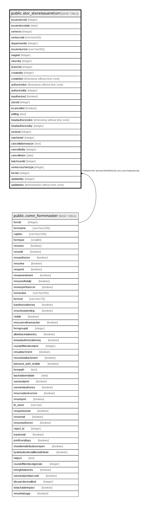

# public.stor_storeissuereturn

## Description

## Columns

| Name | Type | Default | Nullable | Children | Parents | Comment |
| ---- | ---- | ------- | -------- | -------- | ------- | ------- |
| issuereturnid | integer | nextval('stor_storeissuereturn_issuereturnid_seq'::regclass) | false |  |  |  |
| issuereturndate | date |  | true |  |  |  |
| seriesno | integer |  | true |  |  |  |
| seriescode | varchar(50) |  | true |  |  |  |
| departmentid | integer |  | true |  |  |  |
| issuereturnno | varchar(50) |  | true |  |  |  |
| stageid | integer |  | true |  |  |  |
| returnby | integer |  | true |  |  |  |
| branchid | integer |  | true |  |  |  |
| createdby | integer |  | true |  |  |  |
| createdon | timestamp without time zone | now() | true |  |  |  |
| authorizedon | timestamp without time zone |  | true |  |  |  |
| authorizedby | integer |  | true |  |  |  |
| isauthorized | boolean | false | false |  |  |  |
| storeid | integer |  | true |  |  |  |
| iscancelled | boolean | false | true |  |  |  |
| editlog | text |  | true |  |  |  |
| headauthorizedon | timestamp without time zone |  | true |  |  |  |
| headauthorizedby | integer |  | true |  |  |  |
| seriesid | integer |  | true |  |  |  |
| machineid | integer |  | true |  |  |  |
| cancellationreason | text |  | true |  |  |  |
| cancelledby | integer |  | true |  |  |  |
| cancelledon | date |  | true |  |  |  |
| batchcardid | integer |  | true |  |  |  |
| seriesvouchertype | integer |  | true |  |  |  |
| formid | integer | 75 | false |  | [public.comn_formmaster](public.comn_formmaster.md) |  |
| updatedby | integer |  | true |  |  |  |
| updatedon | timestamp(6) without time zone | NULL::timestamp without time zone | true |  |  |  |

## Constraints

| Name | Type | Definition |
| ---- | ---- | ---------- |
| stor_storeissuereturn_formid_fkey | FOREIGN KEY | FOREIGN KEY (formid) REFERENCES comn_formmaster(formid) |
| stor_storeissuereturn_pkey | PRIMARY KEY | PRIMARY KEY (issuereturnid) |

## Indexes

| Name | Definition |
| ---- | ---------- |
| stor_storeissuereturn_pkey | CREATE UNIQUE INDEX stor_storeissuereturn_pkey ON public.stor_storeissuereturn USING btree (issuereturnid) |

## Triggers

| Name | Definition |
| ---- | ---------- |
| tgr_updatecostdate_strisuret | CREATE TRIGGER tgr_updatecostdate_strisuret AFTER INSERT OR UPDATE ON public.stor_storeissuereturn FOR EACH ROW EXECUTE FUNCTION tgr_updatecostdate() |

## Relations

---

> Generated by [tbls](https://github.com/k1LoW/tbls)
