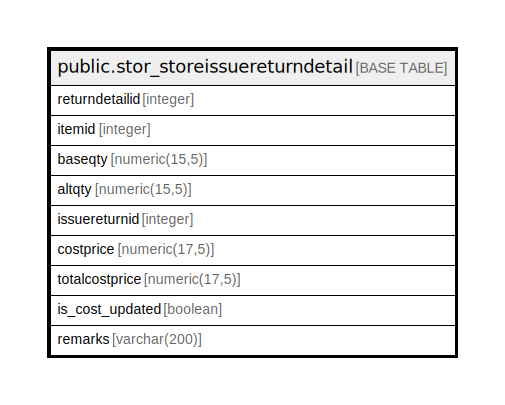

# public.stor_storeissuereturndetail

## Description

## Columns

| Name | Type | Default | Nullable | Children | Parents | Comment |
| ---- | ---- | ------- | -------- | -------- | ------- | ------- |
| returndetailid | integer | nextval('stor_storeissuereturndetail_returndetailid_seq'::regclass) | false |  |  |  |
| itemid | integer |  | true |  |  |  |
| baseqty | numeric(15,5) |  | true |  |  |  |
| altqty | numeric(15,5) |  | true |  |  |  |
| issuereturnid | integer |  | true |  |  |  |
| costprice | numeric(17,5) | 0 | true |  |  |  |
| totalcostprice | numeric(17,5) | 0 | true |  |  |  |
| is_cost_updated | boolean | true | false |  |  |  |
| remarks | varchar(200) |  | true |  |  |  |

## Triggers

| Name | Definition |
| ---- | ---------- |
| storeissuereturndetail_trg_checkstock | CREATE TRIGGER storeissuereturndetail_trg_checkstock BEFORE INSERT OR UPDATE ON public.stor_storeissuereturndetail FOR EACH ROW EXECUTE FUNCTION trg_checkstock() |

## Relations

---

> Generated by [tbls](https://github.com/k1LoW/tbls)
