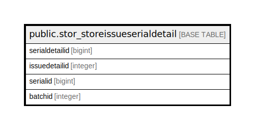

# public.stor_storeissueserialdetail

## Description

## Columns

| Name | Type | Default | Nullable | Children | Parents | Comment |
| ---- | ---- | ------- | -------- | -------- | ------- | ------- |
| serialdetailid | bigint | nextval('stor_storeissueserialdetail_serialdetailid_seq'::regclass) | false |  |  |  |
| issuedetailid | integer |  | true |  |  |  |
| serialid | bigint |  | true |  |  |  |
| batchid | integer |  | true |  |  |  |

## Constraints

| Name | Type | Definition |
| ---- | ---- | ---------- |
| stor_storeissueserialdetail_pkey | PRIMARY KEY | PRIMARY KEY (serialdetailid) |

## Indexes

| Name | Definition |
| ---- | ---------- |
| stor_storeissueserialdetail_pkey | CREATE UNIQUE INDEX stor_storeissueserialdetail_pkey ON public.stor_storeissueserialdetail USING btree (serialdetailid) |

## Triggers

| Name | Definition |
| ---- | ---------- |
| serialhistorydata | CREATE TRIGGER serialhistorydata BEFORE INSERT ON public.stor_storeissueserialdetail FOR EACH ROW EXECUTE FUNCTION tgr_serialhistory() |
| storeissueserial_trg_check | CREATE TRIGGER storeissueserial_trg_check BEFORE INSERT ON public.stor_storeissueserialdetail FOR EACH ROW EXECUTE FUNCTION trg_checkstock() |

## Relations

---

> Generated by [tbls](https://github.com/k1LoW/tbls)
