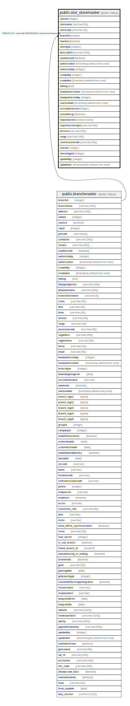

# public.stor_storemaster

## Description

## Columns

| Name | Type | Default | Nullable | Children | Parents | Comment |
| ---- | ---- | ------- | -------- | -------- | ------- | ------- |
| storeid | integer | nextval('stor_storemaster_storeid_seq'::regclass) | false |  |  |  |
| storename | varchar(50) |  | true |  |  |  |
| storecode | varchar(10) |  | true |  |  |  |
| branchid | integer |  | true |  | [public.branchmaster](public.branchmaster.md) |  |
| isactive | boolean | true | false |  |  |  |
| storetype | integer |  | true |  |  |  |
| description | varchar(200) |  | true |  |  |  |
| isauthorized | boolean | false | false |  |  |  |
| authorizedon | timestamp without time zone |  | true |  |  |  |
| authorizedby | integer |  | true |  |  |  |
| createdby | integer |  | true |  |  |  |
| createdon | timestamp without time zone | now() | true |  |  |  |
| editlog | text |  | true |  |  |  |
| headauthorizedon | timestamp without time zone |  | true |  |  |  |
| headauthorizedby | integer |  | true |  |  |  |
| inactivedate | timestamp without time zone |  | true |  |  |  |
| excisablestoreid | integer |  | true |  |  |  |
| isusedforrg1 | boolean | false | true |  |  |  |
| importstoreid | numeric(18,0) |  | true |  |  |  |
| importexciseregno | varchar(50) |  | true |  |  |  |
| division | varchar(100) |  | true |  |  |  |
| range | varchar(100) |  | true |  |  |  |
| commissionerate | varchar(100) |  | true |  |  |  |
| storefor | integer | 1 | true |  |  |  |
| storestageid | integer | nextval('storestageid_seq'::regclass) | false |  |  | This is common auto generated id for both table. |
| updatedby | integer |  | true |  |  |  |
| updatedon | timestamp(6) without time zone | NULL::timestamp without time zone | true |  |  |  |

## Constraints

| Name | Type | Definition |
| ---- | ---- | ---------- |
| storemaster_branchid_fkey | FOREIGN KEY | FOREIGN KEY (branchid) REFERENCES branchmaster(branchid) |
| storemaster_pkey | PRIMARY KEY | PRIMARY KEY (storeid) |
| storemaster_storename_key | UNIQUE | UNIQUE (storename, branchid) |

## Indexes

| Name | Definition |
| ---- | ---------- |
| storemaster_pkey | CREATE UNIQUE INDEX storemaster_pkey ON public.stor_storemaster USING btree (storeid) |
| storemaster_storename_key | CREATE UNIQUE INDEX storemaster_storename_key ON public.stor_storemaster USING btree (storename, branchid) |

## Relations

---

> Generated by [tbls](https://github.com/k1LoW/tbls)
