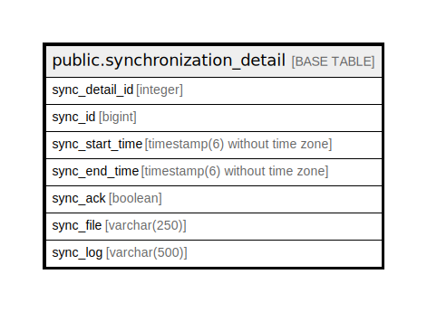

# public.synchronization_detail

## Description

## Columns

| Name | Type | Default | Nullable | Children | Parents | Comment |
| ---- | ---- | ------- | -------- | -------- | ------- | ------- |
| sync_detail_id | integer | nextval('synchronization_detail_sync_detail_id_seq'::regclass) | false |  |  |  |
| sync_id | bigint |  | true |  |  |  |
| sync_start_time | timestamp(6) without time zone |  | true |  |  |  |
| sync_end_time | timestamp(6) without time zone |  | true |  |  |  |
| sync_ack | boolean |  | true |  |  |  |
| sync_file | varchar(250) |  | true |  |  |  |
| sync_log | varchar(500) |  | true |  |  |  |

## Constraints

| Name | Type | Definition |
| ---- | ---- | ---------- |
| synchronization_detail_pkey | PRIMARY KEY | PRIMARY KEY (sync_detail_id) |

## Indexes

| Name | Definition |
| ---- | ---------- |
| synchronization_detail_pkey | CREATE UNIQUE INDEX synchronization_detail_pkey ON public.synchronization_detail USING btree (sync_detail_id) |

## Relations

---

> Generated by [tbls](https://github.com/k1LoW/tbls)
