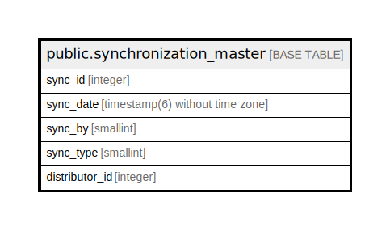

# public.synchronization_master

## Description

## Columns

| Name | Type | Default | Nullable | Children | Parents | Comment |
| ---- | ---- | ------- | -------- | -------- | ------- | ------- |
| sync_id | integer | nextval('synchronization_master_sync_id_seq'::regclass) | false |  |  |  |
| sync_date | timestamp(6) without time zone |  | true |  |  |  |
| sync_by | smallint |  | true |  |  |  |
| sync_type | smallint |  | true |  |  | 0 -> ImportData 1 -> ExportData |
| distributor_id | integer |  | true |  |  |  |

## Constraints

| Name | Type | Definition |
| ---- | ---- | ---------- |
| synchronization_master_pkey | PRIMARY KEY | PRIMARY KEY (sync_id) |

## Indexes

| Name | Definition |
| ---- | ---------- |
| synchronization_master_pkey | CREATE UNIQUE INDEX synchronization_master_pkey ON public.synchronization_master USING btree (sync_id) |

## Relations

---

> Generated by [tbls](https://github.com/k1LoW/tbls)
