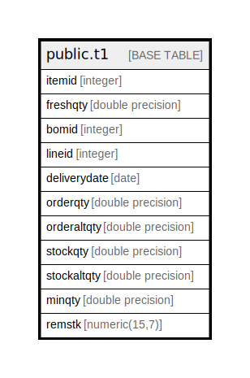

# public.t1

## Description

## Columns

| Name | Type | Default | Nullable | Children | Parents | Comment |
| ---- | ---- | ------- | -------- | -------- | ------- | ------- |
| itemid | integer |  | false |  |  |  |
| freshqty | double precision |  | false |  |  |  |
| bomid | integer |  | true |  |  |  |
| lineid | integer |  | false |  |  |  |
| deliverydate | date |  | true |  |  |  |
| orderqty | double precision | 0 | false |  |  |  |
| orderaltqty | double precision | 0 | false |  |  |  |
| stockqty | double precision | 0 | false |  |  |  |
| stockaltqty | double precision | 0 | false |  |  |  |
| minqty | double precision | 0 | false |  |  |  |
| remstk | numeric(15,7) |  | true |  |  |  |

## Constraints

| Name | Type | Definition |
| ---- | ---- | ---------- |
| t1_pkey | PRIMARY KEY | PRIMARY KEY (lineid) |

## Indexes

| Name | Definition |
| ---- | ---------- |
| t1_pkey | CREATE UNIQUE INDEX t1_pkey ON public.t1 USING btree (lineid) |

## Relations

---

> Generated by [tbls](https://github.com/k1LoW/tbls)
