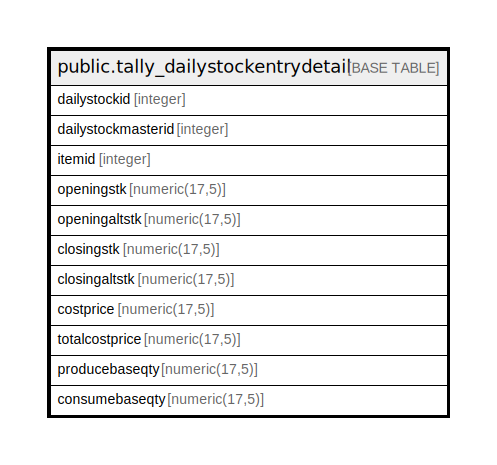

# public.tally_dailystockentrydetail

## Description

## Columns

| Name | Type | Default | Nullable | Children | Parents | Comment |
| ---- | ---- | ------- | -------- | -------- | ------- | ------- |
| dailystockid | integer | nextval('tally_dailystockentrydetail_dailystockid_seq'::regclass) | false |  |  |  |
| dailystockmasterid | integer |  | false |  |  |  |
| itemid | integer |  | true |  |  |  |
| openingstk | numeric(17,5) | 0 | true |  |  |  |
| openingaltstk | numeric(17,5) | 0 | true |  |  |  |
| closingstk | numeric(17,5) | 0 | true |  |  |  |
| closingaltstk | numeric(17,5) | 0 | true |  |  |  |
| costprice | numeric(17,5) | 0 | true |  |  |  |
| totalcostprice | numeric(17,5) | 0 | true |  |  |  |
| producebaseqty | numeric(17,5) | 0 | true |  |  |  |
| consumebaseqty | numeric(17,5) | 0 | true |  |  |  |

## Constraints

| Name | Type | Definition |
| ---- | ---- | ---------- |
| tally_dailystockentrydetail_pkey | PRIMARY KEY | PRIMARY KEY (dailystockid) |

## Indexes

| Name | Definition |
| ---- | ---------- |
| tally_dailystockentrydetail_pkey | CREATE UNIQUE INDEX tally_dailystockentrydetail_pkey ON public.tally_dailystockentrydetail USING btree (dailystockid) |

## Relations

---

> Generated by [tbls](https://github.com/k1LoW/tbls)
