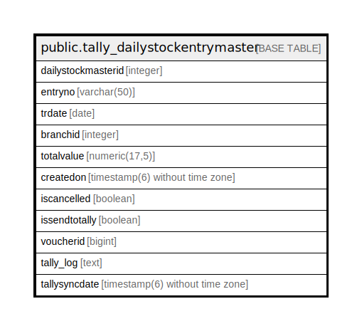

# public.tally_dailystockentrymaster

## Description

## Columns

| Name | Type | Default | Nullable | Children | Parents | Comment |
| ---- | ---- | ------- | -------- | -------- | ------- | ------- |
| dailystockmasterid | integer | nextval('tally_dailystockentrymaster_dailystockmasterid_seq'::regclass) | false |  |  |  |
| entryno | varchar(50) |  | true |  |  |  |
| trdate | date |  | false |  |  |  |
| branchid | integer |  | true |  |  |  |
| totalvalue | numeric(17,5) | 0 | true |  |  |  |
| createdon | timestamp(6) without time zone | now() | true |  |  |  |
| iscancelled | boolean | false | true |  |  |  |
| issendtotally | boolean | false | true |  |  |  |
| voucherid | bigint | 0 | true |  |  |  |
| tally_log | text | ''::text | true |  |  |  |
| tallysyncdate | timestamp(6) without time zone |  | true |  |  |  |

## Constraints

| Name | Type | Definition |
| ---- | ---- | ---------- |
| tally_dailystockentrymaster_pkey | PRIMARY KEY | PRIMARY KEY (dailystockmasterid) |

## Indexes

| Name | Definition |
| ---- | ---------- |
| tally_dailystockentrymaster_pkey | CREATE UNIQUE INDEX tally_dailystockentrymaster_pkey ON public.tally_dailystockentrymaster USING btree (dailystockmasterid) |

## Relations

---

> Generated by [tbls](https://github.com/k1LoW/tbls)
