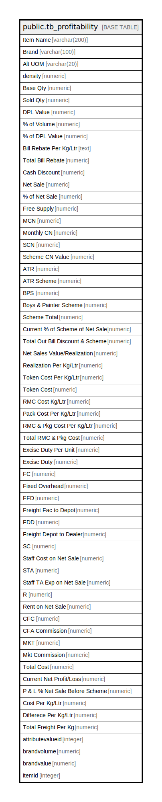

# public.tb_profitability

## Description

## Columns

| Name | Type | Default | Nullable | Children | Parents | Comment |
| ---- | ---- | ------- | -------- | -------- | ------- | ------- |
| Item Name | varchar(200) |  | true |  |  |  |
| Brand | varchar(100) |  | true |  |  |  |
| Alt UOM | varchar(20) |  | true |  |  |  |
| density | numeric |  | true |  |  |  |
| Base Qty | numeric |  | true |  |  |  |
| Sold Qty | numeric |  | true |  |  |  |
| DPL Value | numeric |  | true |  |  |  |
| % of Volume | numeric |  | true |  |  |  |
| % of DPL Value | numeric |  | true |  |  |  |
| Bill Rebate Per Kg/Ltr | text |  | true |  |  |  |
| Total Bill Rebate | numeric |  | true |  |  |  |
| Cash Discount | numeric |  | true |  |  |  |
| Net Sale | numeric |  | true |  |  |  |
| % of Net Sale | numeric |  | true |  |  |  |
| Free Supply | numeric |  | true |  |  |  |
| MCN | numeric |  | true |  |  |  |
| Monthly CN | numeric |  | true |  |  |  |
| SCN | numeric |  | true |  |  |  |
| Scheme CN Value | numeric |  | true |  |  |  |
| ATR | numeric |  | true |  |  |  |
| ATR Scheme | numeric |  | true |  |  |  |
| BPS | numeric |  | true |  |  |  |
| Boys & Painter Scheme | numeric |  | true |  |  |  |
| Scheme Total | numeric |  | true |  |  |  |
| Current % of Scheme of Net Sale | numeric |  | true |  |  |  |
| Total Out Bill Discount & Scheme | numeric |  | true |  |  |  |
| Net Sales Value/Realization | numeric |  | true |  |  |  |
| Realization Per Kg/Ltr | numeric |  | true |  |  |  |
| Token Cost Per Kg/Ltr | numeric |  | true |  |  |  |
| Token Cost | numeric |  | true |  |  |  |
| RMC Cost Kg/Ltr | numeric |  | true |  |  |  |
| Pack Cost Per Kg/Ltr | numeric |  | true |  |  |  |
| RMC & Pkg Cost Per Kg/Ltr | numeric |  | true |  |  |  |
| Total RMC & Pkg Cost | numeric |  | true |  |  |  |
| Excise Duty Per Unit | numeric |  | true |  |  |  |
| Excise Duty | numeric |  | true |  |  |  |
| FC | numeric |  | true |  |  |  |
| Fixed Overhead | numeric |  | true |  |  |  |
| FFD | numeric |  | true |  |  |  |
| Freight Fac to Depot | numeric |  | true |  |  |  |
| FDD | numeric |  | true |  |  |  |
| Freight Depot to Dealer | numeric |  | true |  |  |  |
| SC | numeric |  | true |  |  |  |
| Staff Cost on Net Sale | numeric |  | true |  |  |  |
| STA | numeric |  | true |  |  |  |
| Staff TA Exp on Net Sale | numeric |  | true |  |  |  |
| R | numeric |  | true |  |  |  |
| Rent on Net Sale | numeric |  | true |  |  |  |
| CFC | numeric |  | true |  |  |  |
| CFA Commission | numeric |  | true |  |  |  |
| MKT | numeric |  | true |  |  |  |
| Mkt Commission | numeric |  | true |  |  |  |
| Total Cost | numeric |  | true |  |  |  |
| Current Net Profit/Loss | numeric |  | true |  |  |  |
| P & L % Net Sale Before Scheme | numeric |  | true |  |  |  |
| Cost Per Kg/Ltr | numeric |  | true |  |  |  |
| Differece Per Kg/Ltr | numeric |  | true |  |  |  |
| Total Freight Per Kg | numeric |  | true |  |  |  |
| attributevalueid | integer |  | true |  |  |  |
| brandvolume | numeric |  | true |  |  |  |
| brandvalue | numeric |  | true |  |  |  |
| itemid | integer |  | true |  |  |  |

## Relations

---

> Generated by [tbls](https://github.com/k1LoW/tbls)
