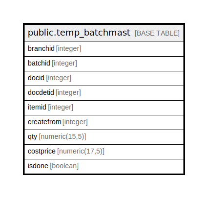

# public.temp_batchmast

## Description

## Columns

| Name | Type | Default | Nullable | Children | Parents | Comment |
| ---- | ---- | ------- | -------- | -------- | ------- | ------- |
| branchid | integer |  | true |  |  |  |
| batchid | integer |  | true |  |  |  |
| docid | integer |  | true |  |  |  |
| docdetid | integer |  | true |  |  |  |
| itemid | integer |  | true |  |  |  |
| createfrom | integer |  | true |  |  |  |
| qty | numeric(15,5) |  | true |  |  |  |
| costprice | numeric(17,5) |  | true |  |  |  |
| isdone | boolean |  | true |  |  |  |

## Relations

---

> Generated by [tbls](https://github.com/k1LoW/tbls)
