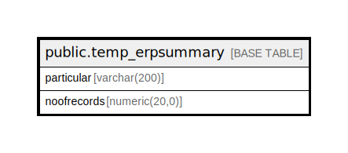

# public.temp_erpsummary

## Description

## Columns

| Name | Type | Default | Nullable | Children | Parents | Comment |
| ---- | ---- | ------- | -------- | -------- | ------- | ------- |
| particular | varchar(200) | NULL::character varying | true |  |  |  |
| noofrecords | numeric(20,0) |  | true |  |  |  |

## Relations

---

> Generated by [tbls](https://github.com/k1LoW/tbls)
