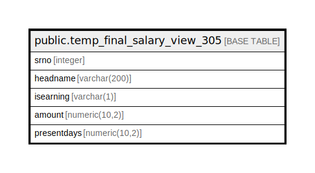

# public.temp_final_salary_view_305

## Description

## Columns

| Name | Type | Default | Nullable | Children | Parents | Comment |
| ---- | ---- | ------- | -------- | -------- | ------- | ------- |
| srno | integer | nextval('temp_final_salary_view_305_srno_seq'::regclass) | false |  |  |  |
| headname | varchar(200) |  | true |  |  |  |
| isearning | varchar(1) |  | true |  |  |  |
| amount | numeric(10,2) |  | true |  |  |  |
| presentdays | numeric(10,2) |  | true |  |  |  |

## Relations

---

> Generated by [tbls](https://github.com/k1LoW/tbls)
